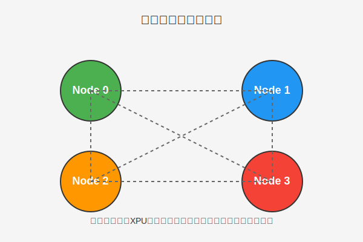
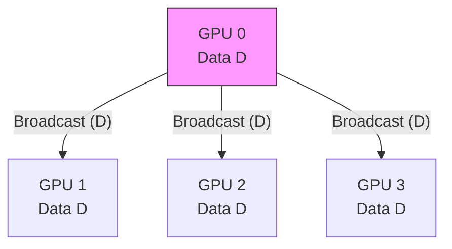
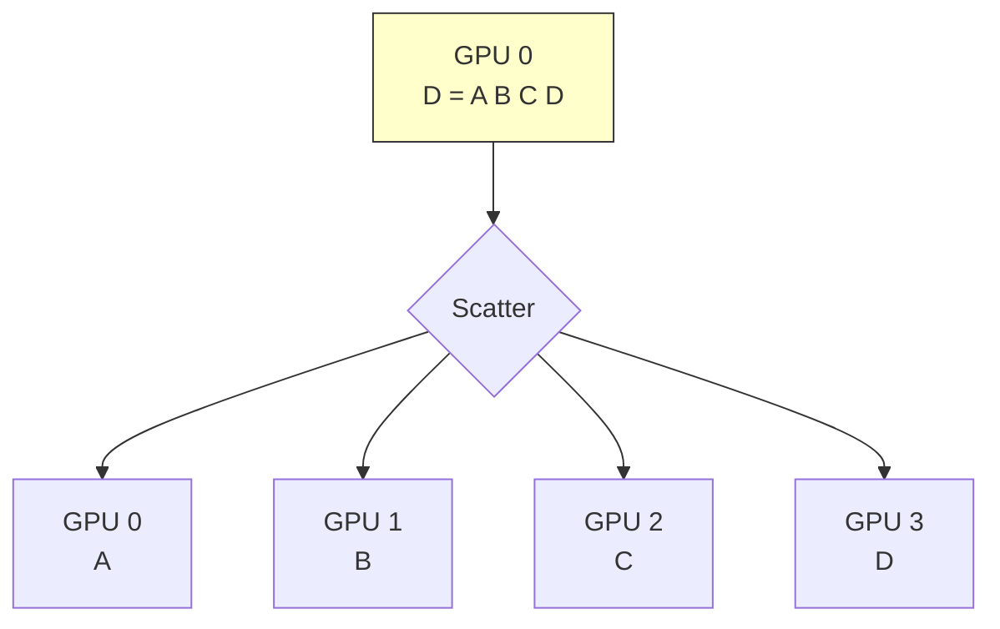
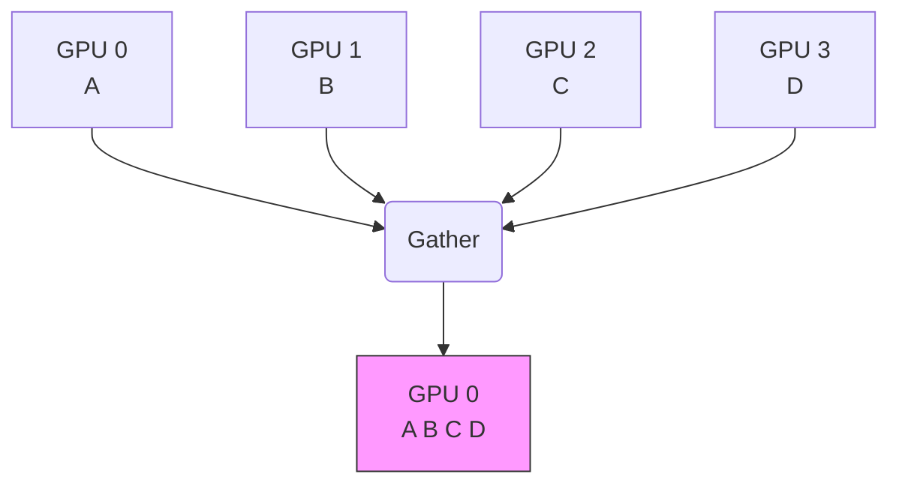
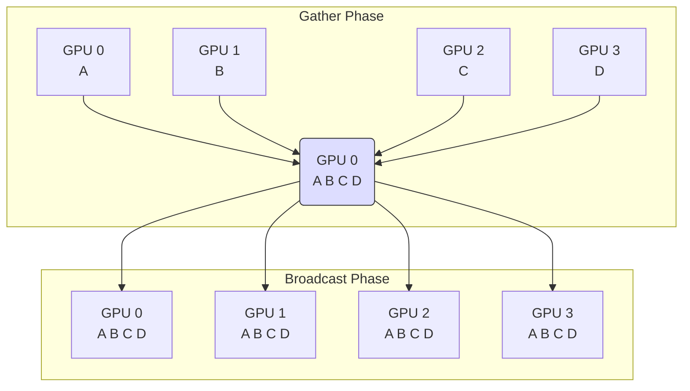
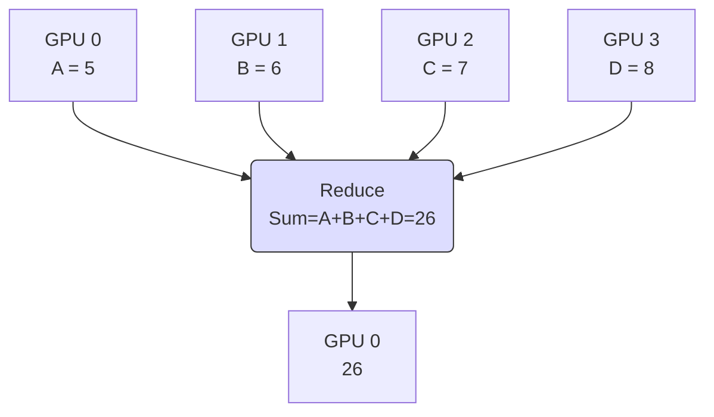
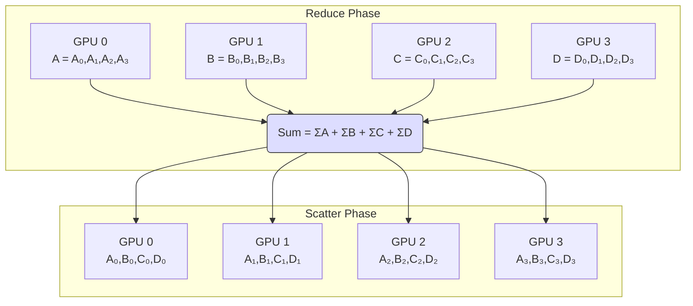
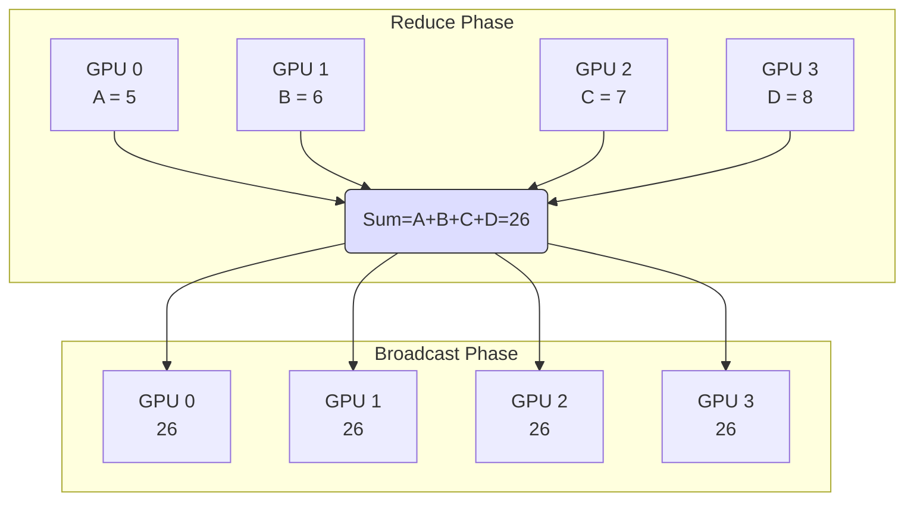
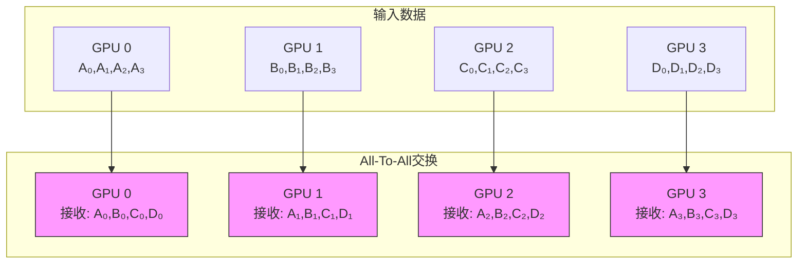

# 分布式训练中常用的集合通信及其通信原语

## 概述

**集合通信（Collective Communication）**是指一个进程组（Process Group）内的所有进程都参与的全局通信操作。基础的通信操作包括**发送（Send）**、**接收（Receive）**、**复制（Copy）**、**组内进程栅障同步（Barrier）**以及**节点间进程同步（Signal + Wait）**。

通过组合这些基本操作，可以构建出一组标准的通信模板，称为**通信原语（Communication Primitives）**。常见的通信原语包括：

- **广播（Broadcast）**：一对多
- **收集（Gather）**：多对一
- **全收集（All-Gather）**：多对多
- **发散（Scatter）**：一对多
- **规约（Reduce）**：多对一
- **全局规约（All-Reduce）**：多对多
- **规约与发散（Reduce-Scatter）**：组合操作
- **全对全（All-to-All）**：多对多

集合通信的难点在于优化**通信效率**以及选择**最佳适用**于特定网络硬件拓扑结构的通信算法。

## 通信原语详解

本节以一台集成了四张训练加速卡（XPU，泛指GPU、NPU、TPU 等）的服务器为例，如下图所示。服务器内的四张GPU卡通常是**全连接**的。其物理连接方式可以是专有互连协议（如 **CXL**、**NVLink**），也可以是通用标准（如 **PCIe**、**InfiniBand** 等）。我们将以此物理拓扑结构描述集合通信中常用的通信原语。

### 1. 广播（Broadcast）

Broadcast 是**一对多**的通信原语，有一个数据发送者（通常是根节点），和多个数据接收者。它将根节点的数据完整地同步到集群内的所有其他节点上。

如下图所示，当主节点 0 执行 Broadcast 时，数据从主节点 0 被广播至所有节点（1、2、3）。

**说明:** 根节点（GPU 0）将数据 $D$ **完整**地发送给所有其他节点。

#### 应用场景：

- **数据并行（Data Parallelism）**中的参数初始化，确保所有 GPU 卡上的初始模型参数一致。
- **All-Reduce** 操作的一种实现方式：通过 **Reduce + Broadcast** 组合实现。
- **参数服务器（Parameter Server, PS）**架构中，Master 节点将最新参数广播至 Worker 节点的操作。

### 2. 发散（Scatter）

Scatter 也是**一对多**的通信原语，有一个数据发送者（根节点），多个数据接收者。与 Broadcast 不同的是，Scatter 会将根节点的完整数据**切片**，然后将不同的数据分片发送给集群内的不同节点。

如下图所示，主节点 0 将数据分为四份（不同颜色方块代表不同的数据），分别分发给了节点 1、2、3（根节点自己也保留一份）。

**说明:** 根节点（GPU 0）将数据 $D = [A B C D]$ **切片**（$A, B, C, D$）后，将不同的分片发送给对应的节点。

#### 应用场景：

- **Reduce-Scatter** 组合操作中的 Scatter 阶段。
- **模型并行（Model Parallelism）**中，初始化时将大型模型切片分发到不同的 GPU 上。

### 3. 收集（Gather）

Gather 是 **多对一** 的通信原语，具有多个数据发送者，一个数据接收者（根节点）。它将集群内所有节点的数据收集到根节点上。

如下图所示，节点 0、1、2、3 上的不同数据（不同颜色方块）被收集并按序拼接到主节点 0 上。

**说明:** 所有节点将各自的数据分片发送给根节点（GPU 0），根节点将它们**拼接**起来。

#### 应用场景：

- Gather 是 Scatter 的**反向操作**。
- 在需要集中处理或保存分布式计算结果时使用。

### 4. 全收集（All-Gather）

All-Gather 是 **多对多** 的通信原语，所有节点既是发送者也是接收者。它将集群内所有节点的数据**完整地收集到所有节点上**。可以视为 **Gather** 操作之后再进行一次 **Broadcast** 操作的组合。

如下图所示，节点 0、1、2、3 上的数据（不同颜色方块）被**完整**地收集，然后被**（广播）Broadcast**给集群内所有节点。

**说明:** 所有节点的数据 $D_i$ 经过收集后，最终的**结果被同步到所有节点上。

#### 应用场景：

- **模型并行**：在模型并行中，有时需要将切分到不同 GPU 上的参数完整同步到每张卡上，才能进行前向计算。
- **All-Gather** 是 **Reduce-Scatter** 的**反向操作**。

### 5. 规约（Reduce）

`Reduce` 是 **多对一** 的通信原语，具有多个数据发送者和一个数据接收者（根节点）。它在集群内每个节点的输入数据上执行一个**指定的规约运算（Reduction Operation）**，然后将得到的精简结果汇聚到根节点上。

常用的规约操作符包括：**求和（SUM）**、**求积（PROD）**、**最大值（MAX）**、**最小值（MIN）**、**逻辑与（LAND）**、**按位与（BAND）**等。这些规约运算的有效性依赖于加速卡对相应算子的支持。

如下图所示，假设执行 **SUM** 规约：节点 0-3 的数值分别为 5、6、7、8，经过 SUM 运算后，累积和 $26$ 汇聚到根节点 0 上。

**说明:** 所有节点的数据 $D_i$ 经过**规约运算**（如 $\sum$ 求和）后，最终的**结果 $R$** 只保存在根节点上。

#### 应用场景：

- **All-Reduce** 操作的一种实现方式：通过 **Reduce + Broadcast** 组合实现。
- **Reduce-Scatter** 组合操作中的 Reduce 阶段。
- **参数服务器**(Parameter Server) 架构中，Worker 节点将梯度数据规约（如求和）回 Master 节点的操作。

### 6. 规约与发散（Reduce-Scatter）

Reduce-Scatter 是 **多对多** 的通信原语。它在集群内的所有节点上执行相同的 **Reduce 规约运算**，然后将**规约结果切片发散（Scatter）**到集群内所有的节点上。

Reduce-Scatter 等价于先在所有节点上执行一次Reduce运算，再将规约结果按节点数进行切分，最后进行一次Scatter操作。它是 **All-Gather** 的**反向操作**。

如下图所示，假设执行 SUM 规约：先对 GPU 0-3 上的数据进行规约，得到完整结果 $\sum_{i=0}^{3}A_i + \sum_{i=0}^{3}B_i + \sum_{i=0}^{3}C_i + \sum_{i=0}^{3}D_i$。然后，将这个完整结果切片（Scatter）分发给所有 GPU 卡，如 GPU 0 获得 $(A_0,B_0,C_0,D_0)$ 分片，GPU 1 获得 $(A_1,B_1,C_1,D_1)$ 分片，GPU 2 获得 $ (A_2,B_2,C_2,D_2) $ 分片，GPU 3 获得 $(A_3,B_3,C_3,D_3)$ 分片。

#### 应用场景：

- **数据并行**：**All-Reduce** 操作的一种高效实现方式：通过 **Reduce-Scatter + All-Gather** 组合实现。
- **模型并行**：在前向计算的 All-Gather 后的反向计算中，常用于梯度规约与分发。

### 7. 全局规约（All-Reduce）

All-Reduce 是 **多对多** 的通信原语。它在集群内的所有节点上执行相同的 **Reduce 规约运算**，并将得到的**规约结果发送到所有的节点上**，确保所有节点最终都获得相同的、经过规约处理的数据。

All-Reduce 操作可以通过 **Reduce + Broadcast** 或 **Reduce-Scatter + All-Gather** 组合实现。

如下图所示，先执行 Reduce 得到规约累加和 $26$，然后将这个累加和 $26$ Broadcast 到所有节点，使得集群内每个节点的数值都保持一致。

#### 应用场景：

- **数据并行**的核心操作：用于聚合所有 GPU 产生的梯度，并在所有 GPU 上同步更新后的全局平均梯度。常见的实现算法包括 **Ring All-Reduce** 和 **Tree All-Reduce**。

### 8. 全对全（All-To-All）

All-To-All 是 **多对多** 的通信原语，它将每一个节点的数据分片（Scatter）到集群内的所有节点上，同时每一个节点也收集（Gather）集群内所有节点发来的数据分片。

All-To-All 可以视为 **All-Gather** 的扩展。区别在于：

- **All-Gather** 中，不同节点向某一节点收集到的数据是**相同**的（因为是全量数据）。
- **All-To-All** 中，不同节点向某一节点收集到的数据是**不同**的（因为是分片数据，且存在转置或重新排列）。

**说明:** 每个节点将自己的数据切片 $D_i$ 发送给**所有**其他节点，同时接收所有节点发来的切片，通常用于矩阵转置。

| 节点      | 发送给 GPU 0 | 发送给 GPU 1 | 发送给 GPU 2 | 发送给 GPU 3 |
| :-------- | :----------- | :----------- | :----------- | :----------- |
| **GPU 0** | $A_{0}$      | $A_{1}$      | $A_{2}$      | $A_{3}$      |
| **GPU 1** | $B_{0}$      | $B_{1}$      | $B_{2}$      | $B_{3}$      |
| **GPU 2** | $C_{0}$      | $C_{1}$      | $C_{2}$      | $C_{3}$      |
| **GPU 3** | $D_{0}$      | $D_{1}$      | $D_{2}$      | $D_{3}$      |

### 应用场景：

- **模型并行**：例如，在**张量并行（Tensor Parallelism）**中，常用于实现不同 GPU 间**矩阵的转置或重新排列**操作。
- **数据并行到模型并行的转换**：涉及数据重分布时的矩阵转置。

## 其他基本同步操作

### 1. 发送（Send）与 接收（Receive）

**点对点（Point-to-Point）通信**的最基本操作，用于在不同 GPU 之间发送和接收数据或参数。

### 2. 栅障同步（Barrier）

**BARRIER** 同步操作会**阻塞**所有调用它的进程，直到通信子（Communicator）中的**所有成员进程**都调用了该函数，进程才会继续执行。它用于确保进程组内的所有进程达到一个预定的同步点。

### 3. 信号（Signal）与 等待（Wait）

**Signal 与 Wait** 属于**记录型信号量机制**，可用于解决进程间的**同步问题**。

- 当一个节点发送数据到另一个节点时，通常会同时 **Signal** 一个事件值（Event）给对端。
- 对端的 **Wait** 操作接收到这个事件时，会返回一个确认给 Signal 方。

这种机制可以确保在节点进程间进行数据同步操作时，数据传输的**有序性和完整性**。

## 小结

在分布式训练过程中，深度学习训练框架通常**不会直接操作底层通信网络**，而是通过使用专业的**网络通信库（如 NCCL、 HCCL、MPI 等）**来完成数据的集合通信。

各家 AI 芯片/加速卡（GPU）厂商都会提供私有的网络通信库（如 `xxx-AWARE` 或 `xCCL`）来实现对底层通信硬件的屏蔽与抽象。

分布式训练集群的网络通信硬件连接样式多种多样，可以是 **Ethernet**、**InfiniBand**、**RoCE v2/v1** 等，也可以是 **CXL**、**NVLink** 等专有协议。因此，通信库的后端层需要根据各个厂商的 SDK 接口，结合实际的网络拓扑结构，实现对应的**最优通信拓扑算法**，从而确保分布式训练的高效性。
