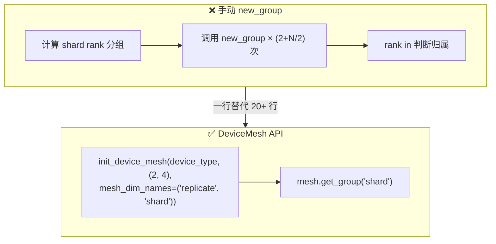
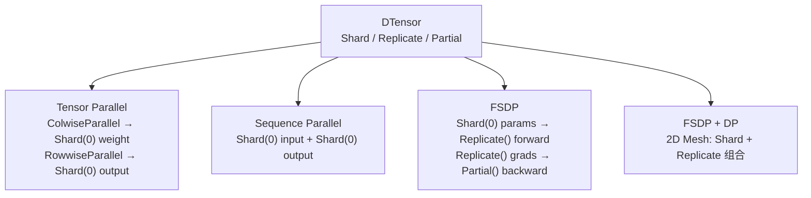
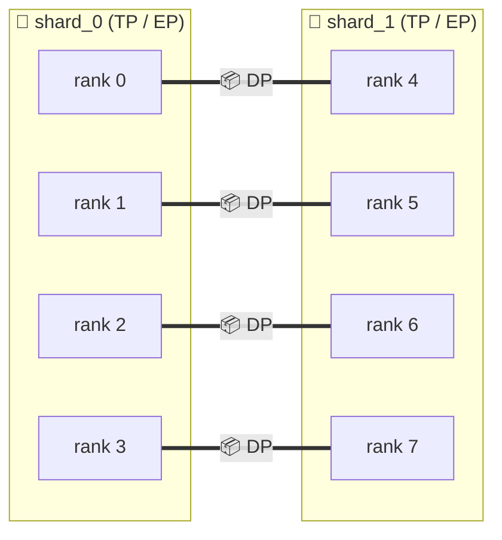
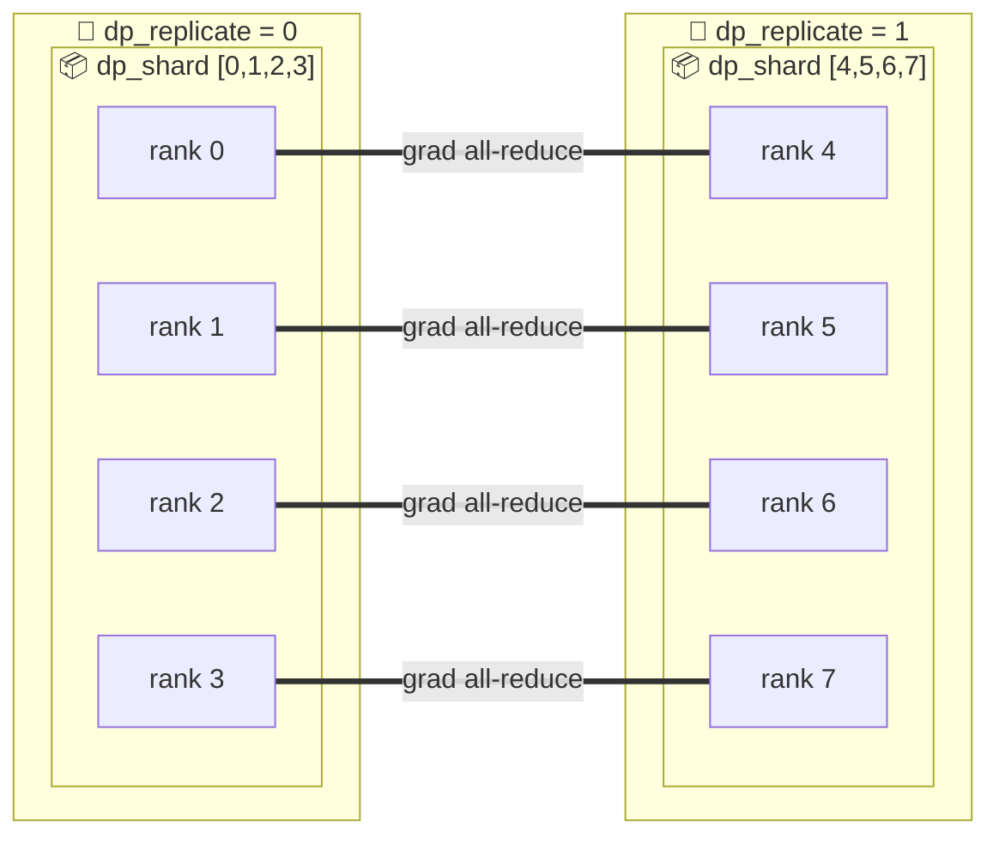
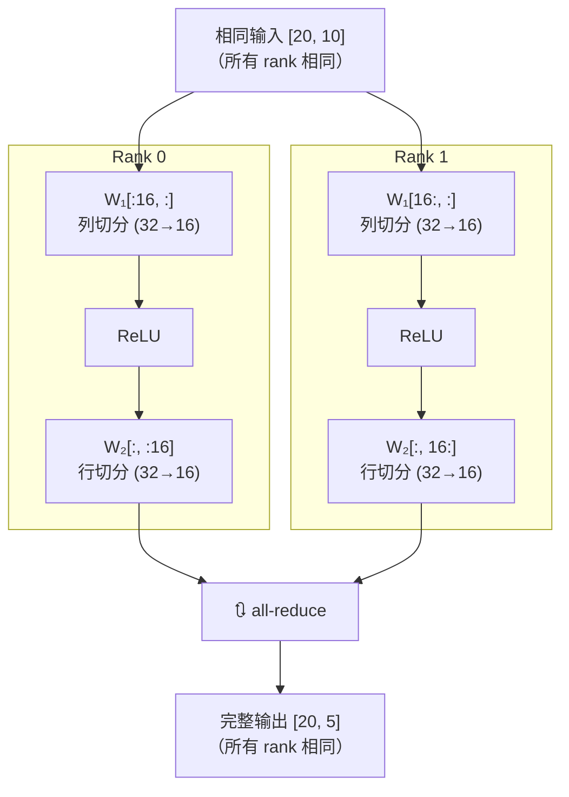
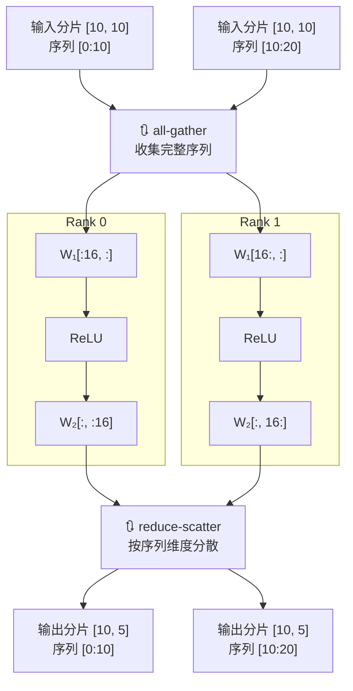
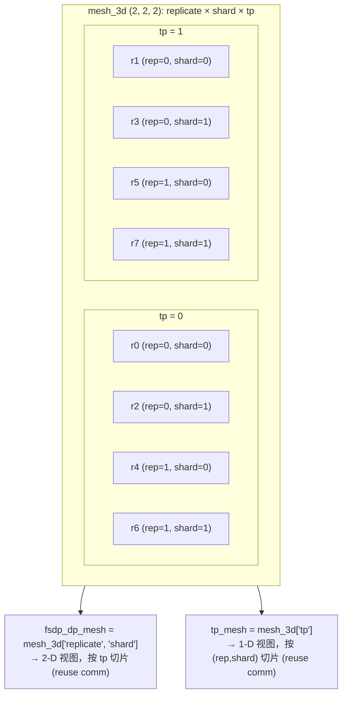

# Device Mesh — 多维进程组拓扑

> **官方参考**：[Getting Started with DeviceMesh](https://docs.pytorch.org/tutorials/recipes/distributed_device_mesh.html)
> (PyTorch ≥ 2.2)

## 什么是 DeviceMesh

DeviceMesh 是 PyTorch 提供的高级分布式抽象，管理底层的 `ProcessGroup`（NCCL/HCCL 通信域）。
它允许用户通过描述设备在多维网格中的 **布局** 来创建节点间和节点内的进程组，
而无需手动计算每个 rank 应该属于哪个子组。



本项目的演示脚本位于 `examples/device_mesh/`，对应官方教程的各个阶段：

| 脚本                          | 方式                                      |
| --------------------------- | --------------------------------------- |
| `dtensor_demo.py`           | Shard / Replicate / Partial — 所有并行策略的基石 |
| `manual_process_group.py`   | 手动 `dist.new_group()` — 理解底层            |
| `device_mesh_api.py`        | `init_device_mesh()` — 生产推荐             |
| `fsdp_dp_demo.py`           | FSDP + DP 混合分片                          |
| `tensor_parallel_demo.py`   | Colwise/Rowwise 权重分片                    |
| `sequence_parallel_demo.py` | TP + 序列维度分片                             |
| `fsdp_tp_demo.py`           | Llama 模型上的 TP + FSDP 组合                 |

***

## 1. 文档定位与快速导航

### 1.1 本文档讲什么

本文档面向 `examples/device_mesh/` 目录下的示例，讲解如何使用 PyTorch 原生的 `DeviceMesh` / `DTensor` API 构建多维进程组拓扑。这些示例是**教学性质**的，用于理解 PyTorch 分布式并行的底层通信抽象。

### 1.2 与 ScaleTorch 核心的关系

ScaleTorch 主仓库在 `scaletorch/parallel/process_group.py` 中实现了自己的 `ProcessGroupManager`，直接管理 4D/5D 进程组网格 `[DP, PP, CP, EP, TP]`，并不依赖 `torch.distributed.device_mesh`。因此：

- 如果你想**学习 PyTorch 官方 DeviceMesh/DTensor 用法**，看本文档和 `examples/device_mesh/`。
- 如果你想**理解 ScaleTorch 训练框架的并行实现**，应阅读 `scaletorch/parallel/process_group.py` 和 `tools/train.py` 中的 `ProcessGroupManager` 使用方式。

### 1.3 示例地图

| 想学习的内容 | 推荐脚本 | 关键 API |
|---|---|---|
| DTensor 三种放置 | `dtensor_demo.py` | `distribute_tensor`, `DTensor.from_local`, `redistribute` |
| 手动 vs DeviceMesh | `manual_process_group.py`, `device_mesh_api.py` | `dist.new_group`, `init_device_mesh` |
| FSDP + DP 混合分片 | `fsdp_dp_demo.py` | `fully_shard`, 2D mesh |
| TP / SP 区别 | `tensor_parallel_demo.py`, `sequence_parallel_demo.py` | `parallelize_module`, `ColwiseParallel`, `RowwiseParallel` |
| FSDP + TP 组合 | `fsdp_tp_demo.py` | 2D mesh 子切片 |
| 3D Mesh 子切片 | 见本文第 10 节 | `mesh_3d["replicate", "shard"]` |

### 1.4 核心速览

- `DeviceMesh` = 用多维网格描述 rank 布局，自动创建子进程组。
- `DTensor` = 在 DeviceMesh 上带有 `Shard / Replicate / Partial` 放置信息的张量。
- 所有高级并行策略（TP、SP、FSDP、FSDP + DP）本质上都是 DTensor placement 的组合。

> **运行前提**：这些示例脚本使用 `device_mod.device_count()` 推断 mesh 大小，默认在单节点运行（`world_size == num_devices`）。多节点场景下需要根据 `world_size` 和每节点设备数分别计算 mesh shape，否则 `init_device_mesh` 会因乘积不匹配而报错。

## 2. DTensor 基础（`dtensor_demo.py`）

DTensor（Distributed Tensor）是 PyTorch 分布式并行的**基石**——TP、SP、FSDP、PP 等所有高级并行策略本质上都是在操作 DTensor 的放置（placement）和重分布（redistribution）。

### 2.1 三种核心放置类型

| 放置 | 含义 | 典型用途 |
|---|---|---|
| `Shard(dim)` | 沿 dim 维度将张量切分到各 rank | TP/SP 的权重分片、FSDP 的参数分片 |
| `Replicate()` | 每个 rank 持有完整副本 | DDP 的模型副本、TP 的输入数据 |
| `Partial()` | 每个 rank 持有部分和（需 reduce 后才能用） | 梯度的 reduce-scatter |

### 2.2 API 对比

| 操作 | API | 说明 |
|---|---|---|
| 从完整张量分发 | `distribute_tensor(full, mesh, placements)` | 一份全量 → 自动切分/复制到所有 rank |
| 从局部张量组合 | `DTensor.from_local(local, mesh, placements)` | 每个 rank 提供自己的分片 → 组合为全局 DTensor |
| 改变放置方式 | `dtensor.redistribute(mesh, new_placements)` | 在 Shard/Replicate/Partial 之间转换 |

> **关键区别**：`distribute_tensor` 在所有 rank 上接收**相同**的完整张量然后切分；
> `DTensor.from_local` 在每个 rank 上接收**不同**的局部张量然后组合。

### 2.3 核心代码

```python
from torch.distributed._tensor import DTensor, Partial, Replicate, Shard, distribute_tensor
from torch.distributed.device_mesh import init_device_mesh

mesh = init_device_mesh(device_type, (num_devices,), mesh_dim_names=("shard",))

# 辅助函数：查看 DTensor 的元数据（global shape + placements + mesh）
def _show_spec(name: str, dt: DTensor):
    s = dt._spec
    placements = [
        f"{type(p).__name__}({p.dim})" if isinstance(p, Shard) else type(p).__name__
        for p in s.placements
    ]
    print(f"  [{name}] spec: global_shape={tuple(s.tensor_meta.shape)}, "
          f"placements=[{', '.join(placements)}], mesh_shape={tuple(s.mesh.shape)}")

# Shard: distribute_tensor 自动切分一个完整 tensor 到各 rank
full = torch.arange(16, device=device_mod.current_device()).float()
sharded = distribute_tensor(full, mesh, [Shard(0)])
# 8-rank → rank 0: [0,1], rank 1: [2,3], ..., rank 7: [14,15]

# Replicate: 广播到所有 rank
replicated = distribute_tensor(full, mesh, [Replicate()])

# Partial: 每个 rank 提供自己的局部贡献，redistribute 做 reduce-scatter
local_ones = torch.ones(8) * (rank + 1)
partial_t = DTensor.from_local(local_ones, mesh, [Partial()])
summed = partial_t.redistribute(mesh, [Shard(0)])             # Partial → Shard(0)

# Redistribute 往返
repl = sharded.redistribute(mesh, [Replicate()])              # Shard(0) → Replicate
back = repl.redistribute(mesh, [Shard(0)])                    # Replicate → Shard(0)
assert torch.equal(back.to_local(), sharded.to_local())        # 往返一致
```

### 2.4 8 × NPU 实测输出

```
[rank=0] Shard(0): 8 ranks, global=16 elems, local=[0.0, 1.0]
[rank=1] Shard(0): 8 ranks, global=16 elems, local=[2.0, 3.0]
...
[rank=7] Shard(0): 8 ranks, global=16 elems, local=[14.0, 15.0]
[rank=0] Replicate: all 8 ranks hold full 16 elements ✓
...
[rank=0] Partial→Shard: reduce-scatter, local=[36.0]
...
[rank=0] Redistribute: Shard(0)→Replicate→Shard(0) round-trip ✓
[rank=0] Smoke test: 1+2+...+8 = 36.0 ✓ (all-reduce via Partial)
[rank=0] Done.
```

Rank 0 上 `_show_spec` 输出的 DTensorSpec 元数据：

```
  [Shard(0)]      spec: global_shape=(16,), placements=[Shard(0)],  mesh_shape=(8,)
  [Replicate]     spec: global_shape=(16,), placements=[Replicate], mesh_shape=(8,)
  [Partial]       spec: global_shape=(8,),  placements=[Partial],   mesh_shape=(8,)
  [Partial→Shard] spec: global_shape=(8,),  placements=[Shard(0)],  mesh_shape=(8,)
  [Smoke]         spec: global_shape=(4,),  placements=[Replicate], mesh_shape=(8,)
```

> **解读**：
> - `Shard(0)`: `global_shape=(16,)`, `placements=[Shard(0)]` → 16 元素沿 dim 0 分片到 8 rank，每 rank 2 元素。
> - `Replicate`: `placements=[Replicate]` → 每 rank 持有完整副本。
> - `Partial → Shard(0)`: global shape 不变 `(8,)`，placements 从 `[Partial]` 变为 `[Shard(0)]` —— reduce-scatter 改变了放置方式而非形状。
> - `Smoke`: placements 变为 `[Replicate]` —— `Partial → Replicate` 等价于 all-reduce。

> **验证要点**：
> - Shard: 16 元素均分 8 rank，每 rank 2 元素 ✓
> - Replicate: 所有 rank full tensor ✓
> - Partial→Shard: `1+2+...+8=36` 的 reduce-scatter 结果 ✓
> - 往返: Shard→Replicate→Shard 一致性 ✓
> - Smoke: Partial→Replicate 等价于 all-reduce ✓

### 2.5 与上层策略的关系



> 所有并行策略都是对 DTensor 放置（placement）的组合和重分布（redistribution）。

***

## 3. 后端检测

所有脚本共享同一套 NPU/CUDA 自动检测逻辑：

```python
try:
    import torch_npu
except ImportError:
    device_mod, backend, device_type = torch.cuda, "nccl", "cuda"
else:
    if torch.npu.is_available():
        device_mod, backend, device_type = torch.npu, "hccl", "npu"
    else:
        sys.exit("[script] torch_npu found but NPU is not available.")
```

| 场景                       | `device_mod` | `backend` | `device_type` |
| ------------------------ | ------------ | --------- | ------------- |
| `torch_npu` 未安装          | `torch.cuda` | `nccl`    | `cuda`        |
| `torch_npu` 已安装且 NPU 可用  | `torch.npu`  | `hccl`    | `npu`         |
| `torch_npu` 已安装但 NPU 不可用 | 退出并报错        | —         | —             |

三个变量的用途：

| 变量            | 用途                                                      |
| ------------- | ------------------------------------------------------- |
| `device_mod`  | 统一设备操作：`set_device` / `current_device` / `device_count` |
| `backend`     | `dist.init_process_group(backend)` 的通信后端                |
| `device_type` | `init_device_mesh(device_type, ...)` 的设备类型字符串           |

***

## 4. 分布式引导

```python
rank = int(os.environ["RANK"])
world_size = int(os.environ["WORLD_SIZE"])
local_rank = int(os.environ.get("LOCAL_RANK", os.environ["RANK"]))

dist.init_process_group(backend)
device_mod.set_device(local_rank)
num_devices = device_mod.device_count()
```

- `RANK` / `WORLD_SIZE` / `LOCAL_RANK` 由 `torchrun` 自动注入。
- `init_process_group(backend)` 建立全局默认通信域（所有 rank 参与）。
- `set_device(local_rank)` 将进程绑定到物理 NPU/GPU。

> **注意**：此阶段仅创建 1 个全局组。二维拓扑需要在此基础上创建子组。

***

## 5. 手动方式（`manual_process_group.py`）— 理解底层原理

8 卡场景下，目标拓扑如下：



| 维度        | 组                                            | 策略                   |
| --------- | -------------------------------------------- | -------------------- |
| 实线框       | `shard_0` `[0,1,2,3]`, `shard_1` `[4,5,6,7]` | TP / EP（张量并行 / 专家并行） |
| 粗虚线 `===` | `(0,4)`, `(1,5)`, `(2,6)`, `(3,7)`           | DP / FSDP（数据并行）      |

### 5.1 Shard 组（连续半区）

```python
shard_rank_lists = (
    list(range(0, num_devices // 2)),           # [0, 1, 2, 3]
    list(range(num_devices // 2, num_devices)),  # [4, 5, 6, 7]
)
shard_groups = (
    dist.new_group(shard_rank_lists[0]),
    dist.new_group(shard_rank_lists[1]),
)
current_shard_group = (
    shard_groups[0] if rank in shard_rank_lists[0] else shard_groups[1]
)
```

- 设备按 **连续一半** 切成两个 shard 组。
- `dist.new_group(ranks)` 是**集合操作**：所有 8 个 rank 都必须调用，即使自己不加入该组。
- 每个 rank 通过 `rank in shard_rank_lists[0]` 判断归属并拿到自己的 group handle。

**用途**：Shard 组内做 **张量并行（Tensor Parallelism）** 或 **专家并行（Expert Parallelism）**——
模型的一层被切分到组内的 4 张卡上，组间互不干扰。

### 5.2 Replicate 组（交叉配对）

```python
current_replicate_group = None
current_replicate_ranks = None
shard_factor = len(shard_rank_lists[0])  # = 4
for i in range(num_devices // 2):        # i = 0, 1, 2, 3
    replicate_group_ranks = list(range(i, num_devices, shard_factor))
    replicate_group = dist.new_group(replicate_group_ranks)
    if rank in replicate_group_ranks:
        current_replicate_group = replicate_group
        current_replicate_ranks = replicate_group_ranks
```

`range(i, num_devices, shard_factor)` 以 `shard_factor=4` 为步长生成配对：

| i | `range(i, 8, 4)` | 配对              |
| - | ---------------- | --------------- |
| 0 | `[0, 4]`         | rank 0 ↔ rank 4 |
| 1 | `[1, 5]`         | rank 1 ↔ rank 5 |
| 2 | `[2, 6]`         | rank 2 ↔ rank 6 |
| 3 | `[3, 7]`         | rank 3 ↔ rank 7 |

**用途**：Replicate 组内做 **数据并行（Data Parallelism / FSDP）**——
组内两个 rank 持有相同的模型分片，处理不同 batch 数据，梯度在组内 all-reduce。

### 5.3 拓扑性质

| 维度        | 组大小                | 组数                 | 通信范围                       |
| --------- | ------------------ | ------------------ | -------------------------- |
| Shard     | `num_devices // 2` | 2                  | 组内 all-reduce / all-gather |
| Replicate | 2                  | `num_devices // 2` | 组内 all-reduce 梯度           |

两个维度的组 **正交**：任意两个 rank 恰好在一个维度上属于同一组，在另一个维度上属于不同组。``

***

## 6. Smoke 测试

```python
tensor = torch.ones(1, device=device_mod.current_device()) * (rank + 1)
dist.all_reduce(tensor, group=current_shard_group)
expected = float(sum(r + 1 for r in my_shard_ranks))
assert abs(tensor.item() - expected) < 0.5
```

每个 rank 创建值为 `rank + 1` 的标量张量，在 **shard 组内** 做 all-reduce 求和：

| Shard 组  | Ranks      | 计算            | 期望值      |
| -------- | ---------- | ------------- | -------- |
| shard\_0 | 0, 1, 2, 3 | 1 + 2 + 3 + 4 | **10.0** |
| shard\_1 | 4, 5, 6, 7 | 5 + 6 + 7 + 8 | **26.0** |

输出示例（8 × NPU）：

```
[rank=0] shard_group=[0, 1, 2, 3] replicate_group=[0, 4] all_reduce=10.0 ✓
[rank=4] shard_group=[4, 5, 6, 7] replicate_group=[0, 4] all_reduce=26.0 ✓
...
```

验证了两点：

1. **Shard 组内通信正常**：同一半区的 rank 能正确 all-reduce。
2. **Shard 组间隔离正确**：跨半区的 rank 不参与对方的 all-reduce。

***

## 7. DeviceMesh API 方式

手动 `new_group` 需要管理 2 个 shard 组 + `N/2` 个 replicate 组的创建与匹配。
PyTorch 的 `init_device_mesh` 将这些细节封装为一行调用。

### 7.1 核心代码

```python
from torch.distributed.device_mesh import init_device_mesh

shard_size = num_devices // 2

mesh_2d = init_device_mesh(
    device_type,                              # "npu" or "cuda"
    mesh_shape=(2, shard_size),               # (replicate, shard)
    mesh_dim_names=("replicate", "shard"),
)

shard_group = mesh_2d.get_group(mesh_dim="shard")
replicate_group = mesh_2d.get_group(mesh_dim="replicate")
```

**一行** **`init_device_mesh`** **替代了第 5 节中 20+ 行的手动进程组创建逻辑。**

### 7.2 与手动方式对照

| 操作                 | 手动 `new_group`                                        | DeviceMesh                       |
| ------------------ | ----------------------------------------------------- | -------------------------------- |
| 创建 shard 组         | `dist.new_group([0,1,2,3])` × 2                       | `init_device_mesh(...)` 内部自动     |
| 创建 replicate 组     | `for i in ...: dist.new_group(...)` × 4               | `init_device_mesh(...)` 内部自动     |
| 获取 shard group     | `shard_groups[0] if rank in ... else shard_groups[1]` | `mesh_2d.get_group("shard")`     |
| 获取 replicate group | `if rank in ...: current_replicate_group = ...`       | `mesh_2d.get_group("replicate")` |
| 代码行数               | \~20                                                  | \~5                              |

### 7.3 内部原理

`init_device_mesh(mesh_shape=(2, 4), mesh_dim_names=("replicate", "shard"))` 在内部：

1. 按 `mesh_shape` 将 8 个 rank 排列为 2×4 网格。
2. 沿每个维度自动调用 `dist.new_group()`，为每行/每列创建子通信域。
3. 通过 `get_group(mesh_dim=...)` 暴露对应维度的 ProcessGroup。

等价于在 torchtitan 训练配置中：

```python
mesh = init_device_mesh(
    device_type,
    mesh_shape=(dp_size, tp_size),
    mesh_dim_names=("dp", "tp"),
)
```

二维 Mesh 支持将不同并行策略绑定到不同维度，由 PyTorch 的 `DTensor` 自动推导通信模式，无需手动管理 `new_group()` 调用。

### 7.4 Smoke 测试输出（8 × NPU）

与手动方式输出格式完全一致：

```
[rank=0] shard_group=[0, 1, 2, 3] replicate_group=[0, 4] all_reduce=10.0 ✓
[rank=4] shard_group=[4, 5, 6, 7] replicate_group=[0, 4] all_reduce=26.0 ✓
...
```

***

## 8. FSDP + DP 混合分片（`examples/device_mesh/fsdp_dp_demo.py`）

FSDP + DP 混合分片（FSDP 参数分片 + DP 复制）将 FSDP 参数分片与数据并行复制结合，
通过二维 DeviceMesh 同时降低显存和跨节点通信。

### 8.1 拓扑语义

```
mesh_shape = (2, 4)
mesh_dim_names = ("dp_replicate", "dp_shard")
```



| 维度             | 组大小 | 通信模式                             | 含义                  |
| -------------- | --- | -------------------------------- | ------------------- |
| `dp_shard`     | 4   | FSDP all-gather / reduce-scatter | 参数分片到组内 4 张卡，降低单卡显存 |
| `dp_replicate` | 2   | DP gradient all-reduce           | 跨复制组同步梯度            |

### 8.2 FSDP + DP vs FSDP vs DDP

| 策略       | Mesh                      | 显存            | 跨节点通信                             |
| -------- | ------------------------- | ------------- | --------------------------------- |
| DDP      | 无分片                       | 最高（每卡完整模型）    | all-reduce 梯度                     |
| FSDP     | 1D shard                  | 最低（分片到所有卡）    | all-gather 参数（跨所有节点）              |
| **FSDP + DP** | **2D (replicate, shard)** | **中等（分片到组内）** | **参数通信局限 shard 组，跨 replica 仅传梯度** |

FSDP + DP 的关键优势：参数 all-gather 只发生在 `dp_shard` 组内（通常同节点 NVLink/HCCS），
跨节点的 `dp_replicate` 只传输梯度。

### 8.3 核心代码

```python
from torch.distributed.device_mesh import init_device_mesh
from torch.distributed.fsdp import fully_shard

replicate_size = 2
shard_size = num_devices // replicate_size

mesh_2d = init_device_mesh(
    device_type,
    mesh_shape=(replicate_size, shard_size),
    mesh_dim_names=("dp_replicate", "dp_shard"),
)

model = ToyModel().to(device_mod.current_device())
fsdp_model = fully_shard(model, mesh=mesh_2d)
```

### 8.4 Smoke 测试输出（8 × NPU）

```
[rank=0] FSDP+DP mesh: 2×4 (replicate=DeviceMesh([0, 4]) shard=DeviceMesh([0, 1, 2, 3]))
[rank=4] FSDP+DP mesh: 2×4 (replicate=DeviceMesh([0, 4]) shard=DeviceMesh([4, 5, 6, 7]))
...
[rank=0] FSDP+DP smoke test passed — loss=-1.1440 grad_norm=25.0927 ✓
[rank=3] FSDP+DP smoke test passed — loss=-1.5912 grad_norm=3.6528 ✓
```

> **注**：loss 和 grad\_norm 在不同 rank 上可能不同。每个 rank 通过 `torch.randn` 生成了不同的输入数据，
> 且 FSDP 分片下 `grad_norm` 反映的是当前 rank 持有参数分片的局部梯度范数。
> 若需一致性验证，需固定随机种子。

***

## 9. Tensor Parallel vs Sequence Parallel

TP 和 SP 都使用 1D DeviceMesh 对模型进行列切分（Colwise）+ 行切分（Rowwise）。
核心差异在于**输入数据的分布方式**和**激活值的通信模式**。

### 9.1 Tensor Parallel（TP）

```python
# tensor_parallel_demo.py
"in_proj": ColwiseParallel()             # 输入复制，权重按列切分
"out_proj": RowwiseParallel()            # 权重按行切分，输出 all-reduce
```

> **模型定义**：2-rank TP 下各层权重形状变化：
>
> ```python
> class ToyModel(nn.Module):
>     def __init__(self):
>         self.in_proj  = nn.Linear(10, 32)   # W₁: (32, 10) → 列切 → 每 rank (16, 10)
>         self.relu     = nn.ReLU()
>         self.out_proj = nn.Linear(32, 5)    # W₂: (5, 32)  → 行切 → 每 rank (5, 16)
> ```
>
> 输入 `[20, 10]`，32 通道平分 → 每 rank 16 通道，因此图中切片维度均为 16。



- **输入**：所有 rank 相同（`torch.manual_seed` 固定 seed）
- **通信**：仅 `RowwiseParallel` 末尾一次 **all-reduce**
- **激活显存**：完整（每 rank 持有完整激活张量）

### 9.2 Sequence Parallel（SP）

```python
# sequence_parallel_demo.py
"in_proj": ColwiseParallel(input_layouts=Shard(0))   # 输入按序列维度分片
"out_proj": RowwiseParallel(output_layouts=Shard(0))  # 输出按序列维度分片
```



- **输入**：每个 rank 持有序列的不同分片（`Shard(0)`），无需固定 seed
- **通信**：前端 **all-gather**（收集完整输入）+ 后端 **reduce-scatter**（分散输出）
- **激活显存**：按序列分片（大幅降低长序列场景的激活显存）

### 9.3 对比

| <br />           | TP                       | SP                                |
| ---------------- | ------------------------ | --------------------------------- |
| 输入数据             | **相同**（`manual_seed` 固定） | **不同**（序列维度分片）                    |
| `input_layouts`  | 默认 `Replicate()`         | `Shard(0)` — 沿序列维度切分              |
| `output_layouts` | 默认 `Replicate()`         | `Shard(0)` — 沿序列维度切分              |
| 前置通信             | 无                        | **all-gather**                    |
| 后置通信             | **all-reduce**           | **reduce-scatter**                |
| 通信量              | 1× all-reduce（输出）        | 1× all-gather + 1× reduce-scatter |
| 激活显存             | 完整（与 TP 组大小无关）           | **1/N**（随 TP 组大小线性降低）             |
| 适用场景             | 常规序列（<8K tokens）         | **长序列**（>8K tokens），激活显存是瓶颈       |

### 9.4 代码对照

```python
# TP: 输入相同，输出汇总
"in_proj": ColwiseParallel(),                        # 无 input_layouts → Replicate
"out_proj": RowwiseParallel(),                       # 无 output_layouts → Replicate

# SP: 输入按序列分片，输出按序列分片
"in_proj": ColwiseParallel(input_layouts=Shard(0)),  # Shard(0) → 沿 dim 0 分片
"out_proj": RowwiseParallel(output_layouts=Shard(0)), # Shard(0) → 沿 dim 0 分片
```

> **本质**：SP = TP + 序列维度分片。在 TP 权重分片的基础上，将激活值也按序列维度分片，
> 代价是额外通信（all-gather + reduce-scatter），换来激活显存的线性下降。

### 9.5 2D 组合：FSDP + TP

`fsdp_tp_demo.py` 将 TP 和 FSDP 组合在二维 DeviceMesh 上，应用于 Llama 风格 transformer：

```python
# dp × tp = (world_size // tp_size, tp_size)
mesh_2d = init_device_mesh(device_type, (dp_size, tp_size), mesh_dim_names=("dp", "tp"))

# TP: 在 tp_mesh 上并行化每个 transformer block
tp_mesh = mesh_2d["tp"]
parallelize_module(transformer_block, device_mesh=tp_mesh, parallelize_plan={
    "attention.wq": ColwiseParallel(),
    "attention.wo": RowwiseParallel(output_layouts=Shard(1)),
    ...
})

# FSDP: 在 dp_mesh 上包裹整个模型
dp_mesh = mesh_2d["dp"]
sharded_model = fully_shard(model, mesh=dp_mesh)
```

| 维度   | 策略              | 作用                   |
| ---- | --------------- | -------------------- |
| `tp` | Tensor Parallel | 权重/激活分片（节点内高带宽 HCCS） |
| `dp` | FSDP            | 参数/梯度分片 + 数据并行（跨节点）  |

***

## 10. 三维 Mesh 与子 Mesh 切片

当训练需要组合更多并行策略时（如 TP + DP + PP），可以使用三维 DeviceMesh
并通过切片语法复用父 Mesh 的通信域。

这是官方教程中 "Custom Parallel Solutions" 的 NPU 适配模式。

### 10.1 创建 3D Mesh 并切片

```python
from torch.distributed.device_mesh import init_device_mesh

# 3-D: 2 replicate × 2 shard × 2 tp = 8 devices
mesh_3d = init_device_mesh(
    device_type,
    mesh_shape=(2, 2, 2),
    mesh_dim_names=("replicate", "shard", "tp"),
)

# 子 Mesh 切片——复用父 Mesh 的 NCCL/HCCL 通信域，无额外 new_group 开销
fsdp_dp_mesh = mesh_3d["replicate", "shard"]   # 2-D submesh for FSDP + DP
tp_mesh = mesh_3d["tp"]                      # 1-D submesh for Tensor Parallel

# 从子 Mesh 中获取 ProcessGroup
replicate_group = fsdp_dp_mesh["replicate"].get_group()
shard_group = fsdp_dp_mesh["shard"].get_group()
tp_group = tp_mesh.get_group()
```

### 10.2 子 Mesh 切片原理



> 3D Mesh 将 8 个 rank 按 `torch.arange(8).reshape(2, 2, 2)` 的 C-contiguous 顺序排列为 `(replicate=2, shard=2, tp=2)` 的三维网格。
>
> - `fsdp_dp_mesh = mesh_3d["replicate", "shard"]` 在当前 `tp` 位置提取前两维，形成 **2 组** shape 为 2×2 的 FSDP + DP 子 Mesh，每组 4 个 rank。
> - `tp_mesh = mesh_3d["tp"]` 在当前 `(replicate, shard)` 位置提取第三维，形成 **4 组** 1D TP 子 Mesh，每组 2 个 rank。
> - 切片操作复用父 Mesh 已建立的 NCCL/HCCL 通信域，**零额外开销**。
>
> 注：多维子 Mesh 切片 `mesh[dim1, dim2]` 需要 PyTorch ≥ 2.3；2.2 仅支持单维切片。

### 10.3 典型 3D 并行组合

| 维度          | 策略              | 通信模式                                |
| ----------- | --------------- | ----------------------------------- |
| `replicate` | DP              | 梯度 all-reduce（跨节点）                  |
| `shard`     | FSDP            | 参数 all-gather + reduce-scatter（节点内） |
| `tp`        | Tensor Parallel | 激活 all-reduce（节点内，最高带宽）             |

***

## 11. 最佳实践

### 始终命名 mesh 维度

```python
# ✅ 推荐：命名维度，子 Mesh 切片语义清晰
mesh = init_device_mesh("npu", (2, 4), mesh_dim_names=("replicate", "shard"))
fsdp_dp_mesh = mesh["replicate", "shard"]

# ❌ 避免：未命名，仅能通过索引访问
mesh = init_device_mesh("npu", (2, 4))
```

### 动态匹配设备数

```python
# ✅ 推荐：动态计算 mesh_shape
num_devices = device_mod.device_count()
if num_devices % 2 != 0:
    sys.exit("Need even device count")
mesh = init_device_mesh(device_type, (2, num_devices // 2), ...)

# ❌ 避免：硬编码，在其他设备数下不可用
mesh = init_device_mesh("cuda", (2, 4), ...)
```

### 优先使用 `init_device_mesh` 而非 `DeviceMesh` 直接构造

```python
# ✅ 推荐：init_device_mesh 从 shape + 名称自动构建 mesh tensor
mesh = init_device_mesh("npu", (2, 4), mesh_dim_names=("dp", "tp"))

# ❌ 避免：手动构造 mesh tensor 容易出错，且需要额外 import torch
mesh = DeviceMesh("npu", torch.arange(8).reshape(2, 4))
```

### 使用 `get_group` 而非手动管理 group handle

```python
# ✅ 推荐：按名称获取
shard_group = mesh_2d.get_group(mesh_dim="shard")

# ❌ 避免：手动跟踪哪个 group 变量对应哪个维度
```

### `eager_init` 控制子组创建时机

```python
# 默认 False：子组延迟创建（首次使用时才初始化）
mesh = init_device_mesh("npu", (2, 4), mesh_dim_names=("dp", "tp"))

# True：立即通过 HCCL/NCCL comm split 创建所有子组
mesh = init_device_mesh(
    "npu", (2, 4), mesh_dim_names=("dp", "tp"), eager_init=True
)
```

### 运行方式

所有示例脚本通过 `torchrun` 启动：

```bash
# 单节点 8 卡
torchrun --nproc_per_node=8 examples/device_mesh/manual_process_group.py
torchrun --nproc_per_node=8 examples/device_mesh/device_mesh_api.py
torchrun --nproc_per_node=8 examples/device_mesh/fsdp_dp_demo.py

# 多节点 (以 2 节点 × 8 卡为例)
torchrun --nnodes=2 --nproc_per_node=8 \
    --rdzv_id=100 --rdzv_endpoint=<master_host>:29400 \
    examples/device_mesh/fsdp_dp_demo.py
```

> 目录下还提供了 `run.sh`，会自动 source `set_env.sh` 并默认启动 `dtensor_demo.py`。通过注释/取消注释即可切换要运行的示例，适合在已配置 CANN 环境的 NPU 机器上快速验证。

***

## 12. 常见误区与排错

### `mesh_shape` 乘积必须等于 world size

```python
# ✅ world_size = 8
init_device_mesh(device_type, (2, 4), mesh_dim_names=("replicate", "shard"))

# ❌ RuntimeError: mesh_shape 乘积 12 != world size 8
init_device_mesh(device_type, (3, 4), mesh_dim_names=("replicate", "shard"))
```

### 所有 rank 必须同时调用 `init_device_mesh`

`init_device_mesh` 内部会执行集合通信创建子组。如果某些 rank 未调用或传入不同 shape，会导致 hang 或 NCCL/HCCL 报错。

### `DTensor.from_local` 与 `distribute_tensor` 不要混用

- `distribute_tensor(full, mesh, placements)`：每个 rank 传**相同**的完整张量，函数内部切分/广播。
- `DTensor.from_local(local, mesh, placements)`：每个 rank 传**自己持有**的局部张量。

混用会导致数据重复或形状错误。

### 维度名称不一致导致 `get_group` 失败

```python
mesh = init_device_mesh("npu", (2, 4), mesh_dim_names=("dp", "tp"))
mesh.get_group("shard")   # ❌ KeyError: shard not in mesh_dim_names
mesh.get_group("tp")      # ✅
```

### `eager_init=True` 在 HCCL 上的影响

- 默认 `eager_init=False`：子组延迟创建，首次 `get_group()` 时才初始化。
- `eager_init=True`：调用 `init_device_mesh` 时立即通过 NCCL/HCCL comm split 创建所有子组。

在部分 HCCL 版本中，comm split 可能与已有默认进程组冲突。遇到 `ERR99999` 时可尝试关闭 `eager_init` 或调整 `init_process_group` 的初始化顺序。

### 子 Mesh 切片不改变通信域

`mesh_3d["replicate", "shard"]` 只是复用父 Mesh 已创建的 ProcessGroup，**不会**创建新的 NCCL/HCCL 通信域，因此没有额外开销。但如果父 Mesh 没有预先创建对应维度，切片会触发延迟初始化。

### TP vs SP 选择

- 短序列、通信敏感：优先 TP（仅 1 次 all-reduce）。
- 长序列（>8K tokens）、激活显存敏感：优先 SP（显存按 TP 大小线性降低，代价是多 1 次 all-gather + reduce-scatter）。

### 后端检测顺序

`examples/device_mesh/` 中的脚本优先检测 `torch_npu` 是否存在且 NPU 可用，否则回退 CUDA。注意：仅安装 `torch_npu` 但无 NPU 设备时会直接退出，而不是回退 CUDA。

## 13. 脚本速查

| 脚本                          | 用途                                   | 运行命令                                                                         |
| --------------------------- | ------------------------------------ | ---------------------------------------------------------------------------- |
| `dtensor_demo.py`           | DTensor 基础 (Shard/Replicate/Partial) | `torchrun --nproc_per_node=8 examples/device_mesh/dtensor_demo.py`           |
| `manual_process_group.py`   | 手动 `new_group` 理解底层                  | `torchrun --nproc_per_node=8 examples/device_mesh/manual_process_group.py`   |
| `device_mesh_api.py`        | `init_device_mesh` 简化写法              | `torchrun --nproc_per_node=8 examples/device_mesh/device_mesh_api.py`        |
| `fsdp_dp_demo.py`           | FSDP + DP 混合分片                       | `torchrun --nproc_per_node=8 examples/device_mesh/fsdp_dp_demo.py`           |
| `tensor_parallel_demo.py`   | Tensor Parallel (Megatron-LM)        | `torchrun --nproc_per_node=8 examples/device_mesh/tensor_parallel_demo.py`   |
| `sequence_parallel_demo.py` | Sequence Parallel                    | `torchrun --nproc_per_node=8 examples/device_mesh/sequence_parallel_demo.py` |
| `fsdp_tp_demo.py`           | 2D: FSDP + TP (Llama)                | `torchrun --nproc_per_node=8 examples/device_mesh/fsdp_tp_demo.py`           |

