# 使用 FSDP2 与张量并行训练大规模 Transformer 模型

> **创建时间**：2024-04-19
> **最后更新**：2025-07-18
> **最后验证**：2026-07-11
> **作者**：Wanchao Liang, Tianyu Liu

---

## 概述

本教程演示如何结合**张量并行（Tensor Parallel, TP）**与**完全分片数据并行 2（Fully Sharded Data Parallel 2, FSDP2）**，在数百到数千张 GPU 上训练大规模 Transformer 模型。其中，`torch.distributed.fsdp.fully_shard` 是 PyTorch FSDP2 的入口 API，基于 `DTensor` 对参数、梯度和优化器状态进行逐参数分片。

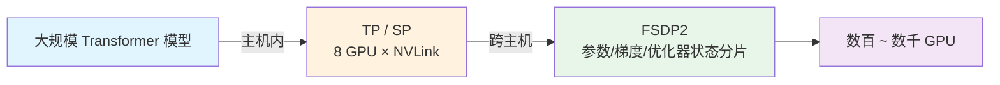

**图 1.** 本教程核心思路：在主机内使用张量并行/序列并行，在主机间使用 FSDP2 分片，实现超大规模 Transformer 训练。

### 前置要求

- PyTorch 2.3.0 或更高版本，需安装 CUDA/Linux 支持
- 了解张量并行 API
- [DeviceMesh 入门指南](https://docs.pytorch.org/tutorials/recipes/distributed_device_mesh.html)
- [FSDP 入门指南](https://docs.pytorch.org/tutorials/intermediate/FSDP_tutorial.html)

---

## 张量并行的工作原理

张量并行最初在 [Megatron-LM 论文](https://arxiv.org/pdf/1909.08053.pdf) 中提出，是一种高效训练大规模 Transformer 模型的模型并行技术。**序列并行（Sequence Parallel, SP）** 是张量并行的一种变体，它在序列维度上对 `nn.LayerNorm` 或 `RMSNorm` 进行分片，以进一步节省训练过程中的激活内存。随着模型规模增大，激活内存往往成为瓶颈，因此在张量并行训练中通常会对 `LayerNorm` 或 `RMSNorm` 层应用序列并行。


**图 2.** Transformer 模型 MLP 和自注意力层上的张量并行风格分片。注意力和 MLP 中的矩阵乘法通过分片计算完成（图片来源：PyTorch 官方教程）。

### 高层视角

PyTorch 张量并行在高层分为两个阶段：

**分片初始化阶段**

1. 确定对每一层应用哪种 `ParallelStyle`。
2. 通过调用 `parallelize_module` 对初始化后的模块进行分片。
3. 并行化后的模块将其模型参数替换为 `DTensor`，`DTensor` 负责使用分片计算运行并行化模块。

**运行时前向/反向阶段**

1. 根据用户为每种 `ParallelStyle` 指定的输入/输出 `DTensor` 布局，运行适当的通信操作以转换输入/输出的 `DTensor` 布局（如 `all_reduce`、`all_gather` 和 `reduce_scatter`）。
2. 对并行化层运行分片计算，以节省计算与内存（例如 `nn.Linear`、`nn.Embedding`）。

> **补充说明**：`DTensor`（Distributed Tensor）是 PyTorch 的分布式张量抽象，通过 `Placement`（如 `Shard(0)`、`Replicate()`）描述张量在不同设备上的分布方式。张量并行利用 `DTensor` 自动处理分片计算与跨设备通信。

---

## 何时以及为何应用张量并行

PyTorch 的 FSDP2 已经能够将模型训练扩展到特定数量的 GPU。然而，当需要进一步在模型大小和 GPU 数量方面扩展训练时，会出现许多额外挑战，这些挑战可能需要将张量并行与 FSDP2 结合使用：

1. **通信延迟主导**

   当 `world_size`（即数据并行维度的大小）变得非常大（超过 128/256 张 GPU）时，FSDP2 的集合通信（如 `all_gather`）会被环形延迟主导。通过在 FSDP2 之上实现 TP/SP，FSDP2 的 `world_size` 可以减少 8 倍（将 FSDP2 仅应用于跨主机），从而将延迟成本降低相同的倍数。

2. **数据并行达到极限**

   当无法将全局批次大小提高到超过 GPU 数量时（由于收敛性和 GPU 内存限制），张量/序列并行是已知的唯一方法来缩小全局批次大小并继续使用更多 GPU 进行扩展。这意味着模型大小和 GPU 数量都可以继续扩展。

3. **FLOPS 优化**

   对于某些类型的模型，当每个 rank 的本地 `batch_size` 变小时，TP/SP 可以产生更适合浮点运算（FLOPS）的矩阵乘法形状。

### 预训练时何时会达到这些极限？

目前，使用数十亿或数万亿 token 预训练大型语言模型（Large Language Model, LLM）通常需要数月时间，即使使用数千张 GPU。

- **极限 1**：在大规模训练 LLM 时总会达到。例如，Llama 2 70B 使用 2K 张 GPU 训练了 35 天，在 2K 规模下需要多维并行。
- **极限 2**：当 Transformer 模型变大时（如 Llama 2 70B），也会很快达到。即使本地 `batch_size=1`，也无法单独使用 FSDP2，因为内存和收敛限制。例如，Llama 2 的全局批次大小为 1K，因此在 2K 张 GPU 上无法单独使用数据并行。

---

## 如何应用张量并行

PyTorch 张量并行 API 提供了一组模块级原语（`ParallelStyle`），用于配置模型每一层的分片，包括：

- **`ColwiseParallel` 和 `RowwiseParallel`**：按列或按行分片 `nn.Linear` 和 `nn.Embedding`。
- **`SequenceParallel`**：对 `nn.LayerNorm`、`nn.Dropout`、`RMSNorm` 等执行分片计算。
- **`PrepareModuleInput` 和 `PrepareModuleOutput`**：配置模块输入/输出的分片布局，并执行适当的通信操作。

### 示例：Llama 2 模型

为了演示如何使用 PyTorch 原生张量并行 API，本教程使用 Llama 2 作为参考 Transformer 模型实现，因为它在社区中也被广泛使用。

由于张量并行将单个张量分片到一组设备上，我们需要首先设置分布式环境（如 NCCL 通信器）。张量并行是一种 **单程序多数据（Single Program Multiple Data, SPMD）** 分片算法，类似于 PyTorch DDP/FSDP2，它在底层利用 PyTorch `DTensor` 执行分片。它还利用 `DeviceMesh` 抽象（底层管理 `ProcessGroup`）进行设备管理和分片。

要了解如何利用 `DeviceMesh` 设置多维并行，请参阅 [DeviceMesh 入门指南](https://docs.pytorch.org/tutorials/recipes/distributed_device_mesh.html)。张量并行通常在每台主机内工作，因此让我们首先初始化一个连接主机内 8 个 GPU 的 `DeviceMesh`：

```python
from torch.distributed.device_mesh import init_device_mesh

tp_mesh = init_device_mesh("cuda", (8,))
```

`init_device_mesh("cuda", (8,))` 创建一个一维的 CUDA 设备网格，包含 8 个 GPU，用于主机内的张量并行。

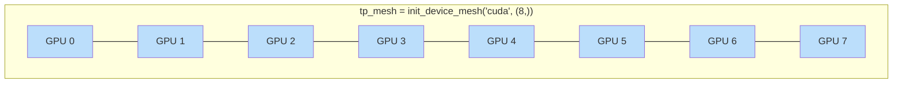

**图 3.** 主机内 8 个 GPU 构成的一维 `DeviceMesh`，用于 8 路张量并行。

现在我们已经初始化了 `DeviceMesh`，接下来详细分析 Llama 2 模型架构，以确定张量并行分片方案。

### 各层 ParallelStyle 选择与示意图

在 Transformer 模型中应用张量并行时，核心思想是：**将每层巨大的矩阵乘法沿特定维度切分到多个 GPU 上，使得每张卡只计算一部分，同时通过最少的集合通信还原完整结果**。下面结合图 2 的 Megatron-LM 风格，逐层说明各 `ParallelStyle` 的选择原因。

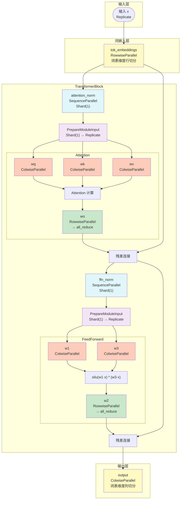

**图 4.** Llama 2 TransformerBlock 中各层 `ParallelStyle` 的选择与数据流向。灰色模块表示 `SequenceParallel` 在序列维度上分片；蓝色模块表示 `ColwiseParallel` 列切分；绿色模块表示 `RowwiseParallel` 行切分；`all_reduce` 标注处表示该位置需要一次集合通信还原完整张量。

#### 整体策略

图 7 展示了 Transformer 中两类核心计算的分片方式：

- **MLP（前馈层）**：将第一个线性投影按**列**切分，第二个按**行**切分，使得两层之间只需一次 `all_reduce`。
- **自注意力层**：将 q/k/v 投影按**列**切分，输出投影按**行**切分，同样只需一次 `all_reduce`。

这种“列-行配对”是张量并行的经典模式，目的是让相邻两层之间的分片布局自然衔接，减少通信次数。

#### 1. 词嵌入层：`RowwiseParallel`

`tok_embeddings` 使用 `RowwiseParallel(input_layouts=Replicate())`，这是由 **Embedding 层的查表语义** 与 **RowwiseParallel 的分片方式** 共同决定的。

##### 为什么按词表维度切分？

`nn.Embedding` 本质上是一个查表操作：

```python
output = embedding_weight[input_ids]
```

张量形状为：

```text
embedding_weight: [vocabulary_size, hidden_size]
input_ids: [batch_size, sequence_length]
output: [batch_size, sequence_length, hidden_size]
```

对每个 token 索引，从权重矩阵的第 `i` 行取出 `hidden_size` 维向量。`RowwiseParallel` 按权重矩阵的第 0 维（行维度）切分，即按**词表维度**切分，使得每张卡只保存一部分词向量。

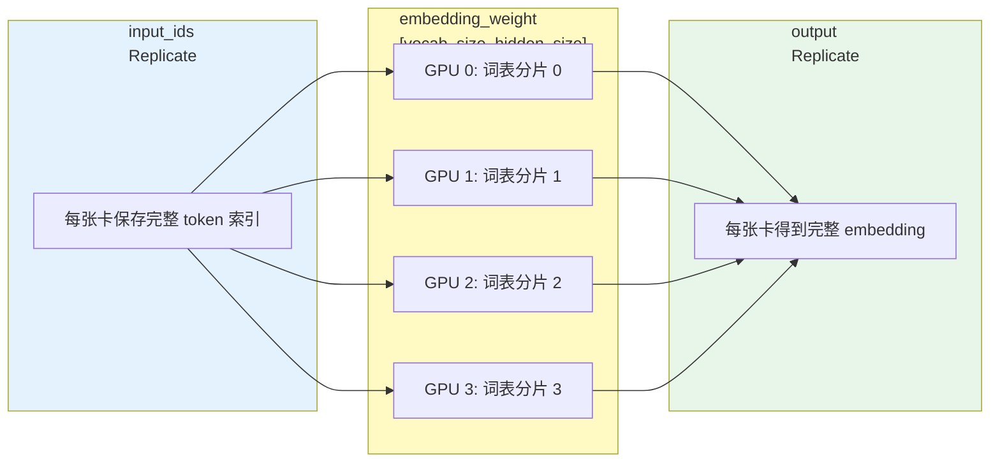

**图 5.** `RowwiseParallel` 词嵌入层：权重按词表维度行切分到各 GPU；`input_ids` 为 `Replicate`，每张卡保存完整 token 索引；输出默认亦为 `Replicate`。

##### 为什么 `input_layouts=Replicate()`？

- **每个 token 可能属于任意词表分片**：`input_ids` 中的 token 索引随机分布，可能落在任意 GPU 的词表分片上。若 `input_ids` 本身分片，某些 GPU 可能缺少自己负责 token 的索引，需要额外通信交换。使用 `Replicate()` 可让每张卡本地判断哪些 token 属于自己。
- **查表后只需一次聚合**：每张卡用完整 `input_ids` 在本地词表分片查表，非本卡负责的 token 位置结果为零（或等价处理），最终通过一次集合通信即可得到完整 embedding 输出。

##### 为什么不用 `ColwiseParallel`？

`ColwiseParallel` 会按 `hidden_size` 维度切分权重。这意味着每个 token 的完整向量被拆分到多张卡上，虽然也能并行，但存在明显劣势：

| 维度 | `RowwiseParallel` | `ColwiseParallel` |
| :--- | :--- | :--- |
| 切分维度 | 词表维度 `vocabulary_size` | 隐藏维度 `hidden_size` |
| 输入布局 | `Replicate` | `Replicate` |
| 查表方式 | 各 GPU 查找自己的词表分片 | 各 GPU 计算每个 token 的部分 hidden |
| 输出聚合 | 一次聚合得到完整输出 | 每个 token 需要跨卡拼接 hidden |
| 语义自然度 | 符合 Embedding 查表语义 | 需要拆分/拼接每个 token 向量 |

因此，对 `nn.Embedding` 而言，`RowwiseParallel` 更自然、通信开销更低。

#### 2. 注意力层：`ColwiseParallel` + `RowwiseParallel`

注意力层使用 `ColwiseParallel` + `RowwiseParallel` 的组合，核心目标是：**将 q/k/v 投影和输出投影矩阵乘法切分到多个 GPU，同时让相邻两层分片布局自然衔接，使整个注意力块只需一次 `all_reduce`**。

##### 注意力层的计算结构

Llama 2 注意力层包含四个线性投影：

```python
q = wq(x)
k = wk(x)
v = wv(x)
out = wo(attn_output)
```

四个权重矩阵形状通常为 `[hidden_size, hidden_size]`，或 `wq` 的输出维度为 `num_heads * head_dim`。

##### 为什么 q/k/v 用 `ColwiseParallel`？

`ColwiseParallel` 对线性层的**输出特征维度**切分。对 `wq`/`wk`/`wv` 而言，即沿 `num_heads * head_dim` 维度切分：

```text
GPU 0: head 0, head 1
GPU 1: head 2, head 3
...
```

这样每张卡只计算一部分注意力头，而不同注意力头之间计算独立，天然适合分片。

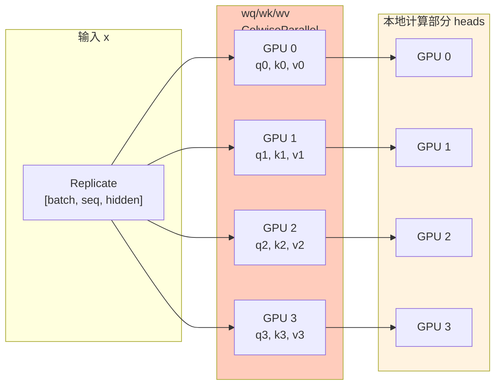

**图 6.** q/k/v 列切分：每个 GPU 只计算一部分注意力头，输出在最后一个维度上分片。

##### 为什么 `wo` 用 `RowwiseParallel`？

`RowwiseParallel` 对线性层的**输入特征维度**切分。`wo` 的输入 `attention_output` 来自各 GPU 独立计算的 heads，在最后一个维度（`hidden_size`）上分片。行切分的 `wo` 恰好接受这种分片输入，因此**在 q/k/v 与 `wo` 之间无需额外通信**。

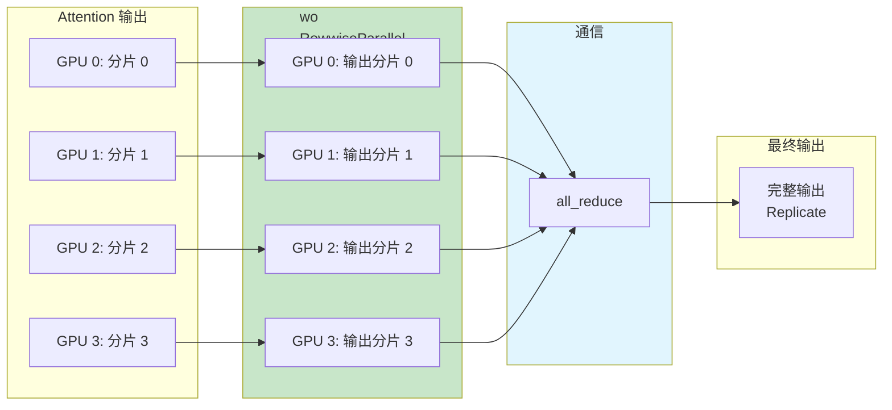

**图 7.** `wo` 行切分：直接接受 Attention 的分片输出，最终通过一次 `all_reduce` 得到完整结果。

##### 为什么 `use_local_output=False`？

对 `wq`/`wk`/`wv` 设置 `use_local_output=False`，表示输出保持为 `DTensor` 而非本地张量。原因如下：

1. **后续有 reshape 操作**：Llama 注意力中会执行 `view(batch, seq, num_heads, head_dim)` 和 `transpose`。列切分后本地 `num_heads` 已变为 `num_heads / tp_size`，需要 `DTensor` 维护全局维度信息。
2. **输入 `wo` 需要分片信息**：`wo` 是 `RowwiseParallel`，期望输入在最后一个维度上分片。`DTensor` 能正确携带该布局进入 `wo`。
3. **避免形状错误**：如果使用本地张量，reshape/transpose 后的形状会丢失分片语义，导致下游计算出错。

##### 通信开销

| 阶段 | 操作 | 通信 |
| :--- | :--- | :--- |
| `wq/wk/wv` | 列切分计算部分 heads | 无 |
| Attention 计算 | 各 GPU 独立计算本地 heads | 无 |
| `wo` | 行切分计算部分输出 | 无 |
| 汇总 | `wo` 输出分片 `all_reduce` 求和 | **一次 `all_reduce`** |

整个注意力块仅需一次 `all_reduce`，这是“列-行配对”设计的最大优势。

##### 与 MLP 的对比

注意力层的分片策略与前馈层完全对称：

| 模块 | 第一层 | 第二层 | 通信 |
| :--- | :--- | :--- | :--- |
| Attention | `wq/wk/wv` 列切分 | `wo` 行切分 | 一次 `all_reduce` |
| MLP | `w1/w3` 列切分 | `w2` 行切分 | 一次 `all_reduce` |

这种“列-行配对”是张量并行的经典模式，相邻层分片布局互补，避免中间插入额外通信。

#### 3. 前馈层：`ColwiseParallel` + `RowwiseParallel`

前馈层使用 `ColwiseParallel` + `RowwiseParallel` 的组合，核心目标是：**将 SwiGLU 风格 MLP 中的三个线性投影切分到多个 GPU，同时让相邻两层分片布局自然衔接，使整个前馈层只需一次 `all_reduce`**。

##### 前馈层的计算结构

Llama 2 的前馈层执行 SwiGLU 激活：

```python
def forward(self, x):
    return self.w2(F.silu(self.w1(x)) * self.w3(x))
```

对应三个线性层：

```text
w1: [hidden_size, intermediate_size]
w3: [hidden_size, intermediate_size]
w2: [intermediate_size, hidden_size]
```

前向计算步骤：

1. `a = w1(x)`，形状 `[batch, seq, intermediate_size]`
2. `b = w3(x)`，形状 `[batch, seq, intermediate_size]`
3. `c = silu(a) * b`，形状 `[batch, seq, intermediate_size]`
4. `out = w2(c)`，形状 `[batch, seq, hidden_size]`

其中 `intermediate_size` 通常是 `hidden_size` 的 4 倍或更大。

##### 为什么 `w1` 和 `w3` 用 `ColwiseParallel`？

`ColwiseParallel` 对线性层的**输出特征维度**切分。对 `w1` 和 `w3` 而言，即沿 `intermediate_size` 维度切分：

```text
GPU 0: intermediate 维度 [0, I/4)
GPU 1: intermediate 维度 [I/4, I/2)
GPU 2: intermediate 维度 [I/2, 3I/4)
GPU 3: intermediate 维度 [3I/4, I)
```

`w1` 和 `w3` 共享同一输入 `x`，且输出在同一维度分片。SwiGLU 的逐元素乘法 `silu(w1(x)) * w3(x)` 可直接在分片状态下进行，无需通信。

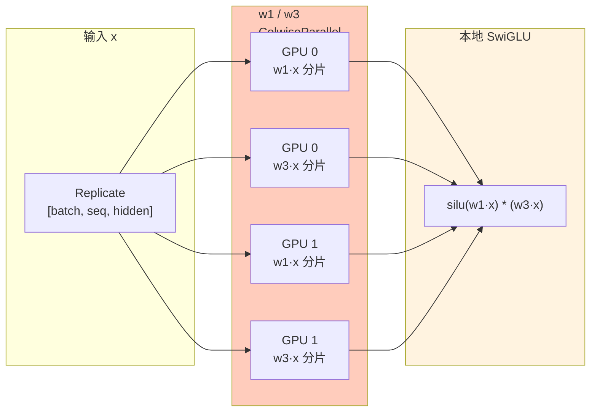

**图 8.** `w1`/`w3` 列切分：两者共享输入 `x`，输出在 `intermediate_size` 维度上分片，SwiGLU 逐元素乘法无需通信。

##### 为什么 `w2` 用 `RowwiseParallel`？

`RowwiseParallel` 对线性层的**输入特征维度**切分。`w2` 的权重形状为 `[intermediate_size, hidden_size]`，行切分意味着：

```text
GPU 0: 输入 intermediate 维度 [0, I/4) 对应的权重行
GPU 1: 输入 intermediate 维度 [I/4, I/2) 对应的权重行
...
```

由于 `w1`/`w3` 的输出在 `intermediate_size` 维度上分片，而行切分的 `w2` 恰好接受在该维度上分片的输入，因此**SwiGLU 输出可以直接进入 `w2`，无需额外通信**。

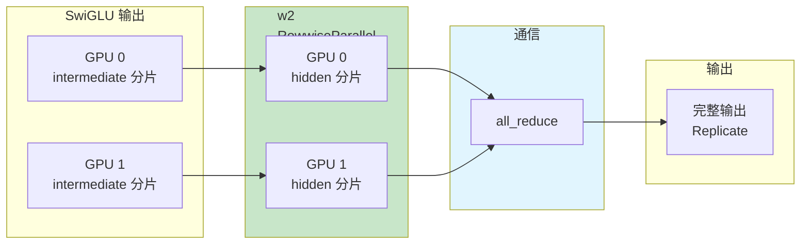

**图 9.** `w2` 行切分：直接接受 SwiGLU 的列切分输出，最终通过一次 `all_reduce` 得到完整结果。

##### 如果反过来会怎样？

| 方案 | `w1/w3` | `w2` | 问题 |
| :--- | :--- | :--- | :--- |
| **推荐** | `ColwiseParallel` | `RowwiseParallel` | SwiGLU 后直接接 `w2`，无需通信 |
| 不推荐 | `RowwiseParallel` | `ColwiseParallel` | `w1/w3` 输出在 hidden 维度分片，SwiGLU 后需要 `all_gather` 才能进入 `w2` |
| 不推荐 | `ColwiseParallel` | `ColwiseParallel` | `w2` 输出在 hidden 维度分片，与后续层的 `Replicate` 不匹配 |

推荐方案的关键在于：**前一层的输出分片维度 = 后一层的输入分片维度**，从而避免中间通信。

##### 通信开销

| 阶段 | 操作 | 通信 |
| :--- | :--- | :--- |
| `w1(x)` | 列切分，各 GPU 计算部分 intermediate | 无 |
| `w3(x)` | 列切分，各 GPU 计算部分 intermediate | 无 |
| `silu(a) * b` | 逐元素乘法，分片状态直接相乘 | 无 |
| `w2(c)` | 行切分，各 GPU 计算部分 hidden | 无 |
| 汇总 | `w2` 输出分片 `all_reduce` 求和 | **一次 `all_reduce`** |

整个前馈层仅需一次 `all_reduce`，与注意力层相同。

##### 与 Attention 的对比

前馈层的分片策略与注意力层完全对称：

| 模块 | 第一层 | 第二层 | 通信 |
| :--- | :--- | :--- | :--- |
| Attention | `wq/wk/wv` 列切分 | `wo` 行切分 | 一次 `all_reduce` |
| MLP | `w1/w3` 列切分 | `w2` 行切分 | 一次 `all_reduce` |

这种“列-行配对”是张量并行的经典模式，相邻层分片布局互补，避免中间插入额外通信。

#### 4. 归一化层：`SequenceParallel`

`attention_norm` 和 `ffn_norm`（即 `LayerNorm` 或 `RMSNorm`）使用 `SequenceParallel()`，核心目的是：**在基本张量并行的基础上，将 Attention/FeedForward 模块外部的激活在序列维度上分片，从而进一步节省激活内存**。

##### 基本张量并行的问题

在基本张量并行中，Attention 和 FeedForward 内部通过 `ColwiseParallel`/`RowwiseParallel` 对权重进行切分，但其模块的输入和输出保持复制状态（`Replicate`）：

```text
输入 x: [batch, seq, hidden] Replicate
 ↓
attention_norm(x) ← 需要完整 x
 ↓
Attention(...) ← 内部分片
 ↓
输出 h: [batch, seq, hidden] Replicate
```

这意味着在进入 `attention_norm` 之前，以及从 Attention 出来之后，每张卡都保存了一份完整的激活张量 `[batch, seq, hidden]`。对于大型模型和长序列，这部分激活内存相当可观。

而 `LayerNorm`/`RMSNorm` 本身的计算量很小，且**按 token 独立计算**：

```python
x_i_norm = x_i * rms_weight / sqrt(mean(x_i ** 2) + eps)  # 对每个 token 向量 x_i 独立计算 RMSNorm
```

每个 token 的归一化不依赖其他 token，因此激活完全没有必要保持复制状态。

##### `SequenceParallel` 做了什么？

`SequenceParallel` 将激活在**序列维度（`sequence_length`，张量第 1 维）**上分片，即使用 `Shard(1)` 布局：

```text
输入激活: [batch, seq, hidden] Replicate
 ↓ SequenceParallel
GPU 0: [batch, seq/4, hidden] Shard(1)
GPU 1: [batch, seq/4, hidden] Shard(1)
GPU 2: [batch, seq/4, hidden] Shard(1)
GPU 3: [batch, seq/4, hidden] Shard(1)
```

这样每个 GPU 只保存和处理一部分 token 的激活，显存占用降低为原来的 `1/tp_size`。

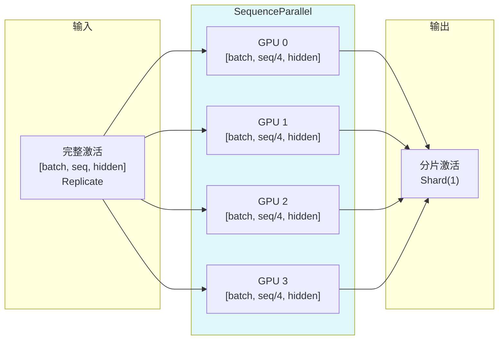

**图 10.** `SequenceParallel` 将激活在序列维度上分片，每张卡只处理部分 token 的归一化。

##### 与 Attention/FeedForward 的衔接

Attention 和 FeedForward 的内部是张量并行，需要输入为 `Replicate`（或符合其 `ParallelStyle` 的特定布局）。因此从 `SequenceParallel` 出来的 `Shard(1)` 激活不能直接送入 Attention/FeedForward，需要通过 `PrepareModuleInput` 进行布局转换：

```python
"attention": PrepareModuleInput(
    input_layouts=(Shard(1), Replicate()),
    desired_input_layouts=(Replicate(), Replicate()),
),
```

同样，Attention/FeedForward 的输出需要重新标记为 `Shard(1)`，以便下一个 `SequenceParallel` 的归一化层接收。

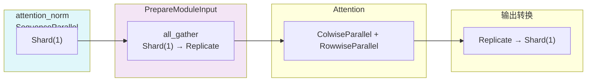

**图 11.** 序列并行与 Attention/FeedForward 的衔接：通过 `PrepareModuleInput` 在 `Shard(1)` 与 `Replicate` 之间转换。

##### 显存节省分析

假设 `batch_size = b`、`sequence_length = s`、`hidden_size = h`、张量并行度 `tp_size = 4`：

| 方案 | 每张卡激活形状 | 激活显存 |
| :--- | :--- | :--- |
| 基本 TP（Replicate） | `[b, s, h]` | `b × s × h` |
| 序列并行（Shard(1)） | `[b, s/4, h]` | `b × s × h / 4` |

激活显存降低为原来的 `1/tp_size`。在序列较长（如 32K、128K）时，这部分节省非常显著。

##### 完整 TransformerBlock 中的数据流

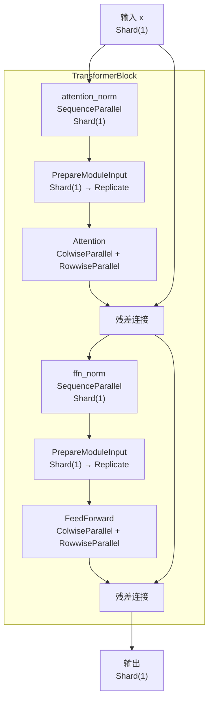

**图 12.** 序列并行下 `TransformerBlock` 的数据流：归一化层保持 `Shard(1)`，Attention/FeedForward 前后通过 `PrepareModuleInput` 转换布局，输入输出始终保持 `Shard(1)` 以便多层堆叠。

#### 5. 输出层：`ColwiseParallel`

输出层 `output` 通常是一个线性投影，将隐藏状态映射到词表空间，用于生成每个 token 在词表上的 logits：

```python
logits = output(hidden_states)
```

权重矩阵形状为 `[hidden_size, vocabulary_size]`，输出形状为 `[batch_size, sequence_length, vocabulary_size]`。

输出层使用 `ColwiseParallel`，核心目标是：**将巨大的词表维度切分到多个 GPU，避免单卡保存完整输出权重和完整 logits 张量**。

##### 为什么用 `ColwiseParallel`？

`ColwiseParallel` 对线性层的**输出特征维度**切分。对 `output` 而言，即沿 `vocabulary_size` 维度切分：

```text
GPU 0: 词表索引 [0, V/4) 的 logits
GPU 1: 词表索引 [V/4, V/2) 的 logits
GPU 2: 词表索引 [V/2, 3V/4) 的 logits
GPU 3: 词表索引 [3V/4, V) 的 logits
```

这样每张卡只计算和保存一部分词表维度的 logits，与输出语义直接对应。

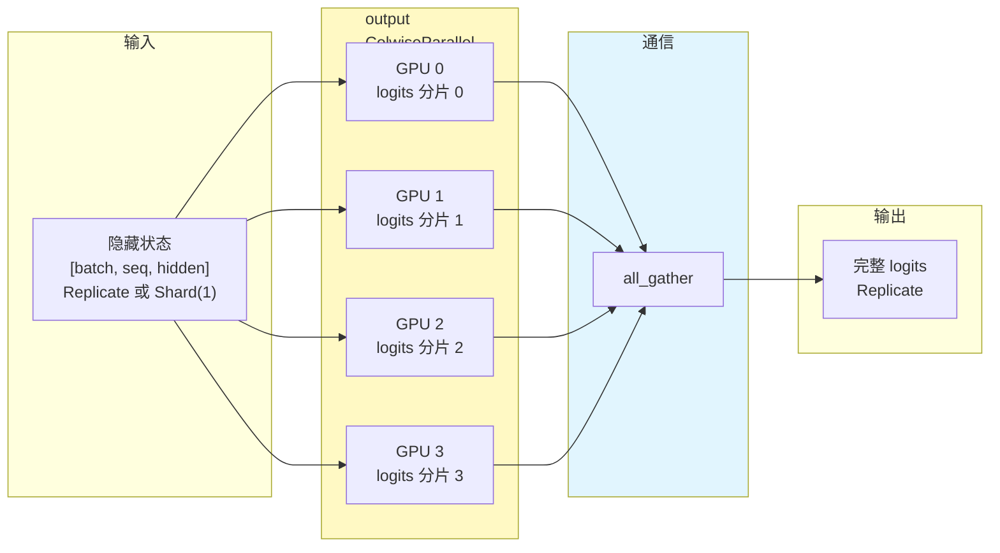

**图 13.** 输出层 `ColwiseParallel`：在词表维度列切分 logits，若 `output_layouts=Replicate` 则通过 `all_gather` 收集完整结果；若启用 Loss Parallel 则保持分片。

##### 为什么不用 `RowwiseParallel`？

`RowwiseParallel` 会按 `hidden_size` 维度切分权重，但这与输出层生成词表 logits 的语义不符：

| 方案 | 切分维度 | 输入要求 | 输出 | 问题 |
| :--- | :--- | :--- | :--- | :--- |
| **推荐：`ColwiseParallel`** | `vocabulary_size` | `hidden` 完整或分片均可 | 词表分片 | 权重按词表切分，符合输出语义 |
| 不推荐：`RowwiseParallel` | `hidden_size` | `hidden` 必须分片 | `hidden` 方向求和 | 输出不是 logits，需要后续转换 |

输出层的任务是产生词表上的 logits，按词表维度切分最自然。

##### 两种输出布局

###### `output_layouts=Replicate()`：标准训练

在标准训练（不使用 Loss Parallel）时，通常设置：

```python
"output": ColwiseParallel(
    output_layouts=Replicate(),
)
```

此时各 GPU 上的 logits 分片通过 `all_gather` 收集到每张卡，得到完整 logits，以便后续计算交叉熵损失。

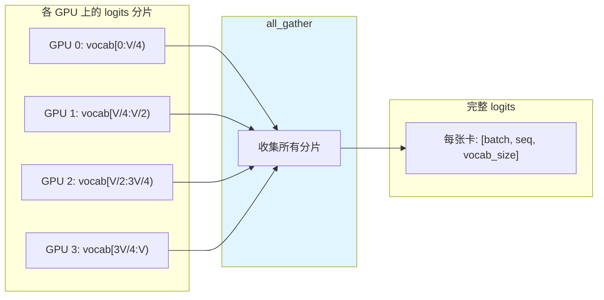

**图 14.** 标准训练下，输出层 logits 分片通过 `all_gather` 收集为完整 `Replicate` 张量。

###### `use_local_output=False`：配合 Loss Parallel

当启用 Loss Parallel 时，设置：

```python
"output": ColwiseParallel(
    input_layouts=Shard(1),
    use_local_output=False,
)
```

此时输出保持为 `DTensor`，在 `vocabulary_size` 维度上分片。`loss_parallel()` 上下文管理器会自动处理分片状态下的交叉熵计算，**无需将所有 logits 收集到每张卡**，显著降低显存和通信开销。

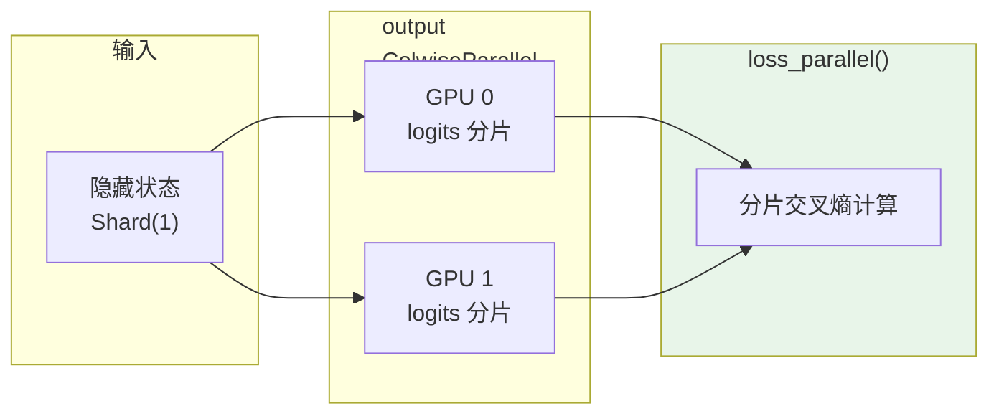

**图 15.** Loss Parallel 模式下，输出层 logits 保持词表维度分片，由 `loss_parallel()` 自动完成交叉熵计算。

##### 显存与通信分析

假设 `batch_size = b`、`sequence_length = s`、`vocabulary_size = V`、张量并行度 `tp_size = 4`：

| 方案 | 每张卡权重 | 每张卡输出 | 显存 | 通信 |
| :--- | :--- | :--- | :--- | :--- |
| 不切分 | `[hidden, V]` | `[b, s, V]` | 单卡存储完整权重和 logits | 无 |
| `ColwiseParallel` + `Replicate` | `[hidden, V/4]` | `[b, s, V]`（收集后） | 权重降低 `tp` 倍，输出临时完整 | `all_gather` |
| `ColwiseParallel` + Loss Parallel | `[hidden, V/4]` | `[b, s, V/4]` | 权重和输出都降低 `tp` 倍 | 无全量收集 |

##### 与词嵌入层的对比

输出层 `output` 与词嵌入层 `tok_embeddings` 结构类似但方向相反：

| 层 | 权重形状 | 映射方向 | 推荐 ParallelStyle |
| :--- | :--- | :--- | :--- |
| `tok_embeddings` | `[vocab_size, hidden_size]` | token id → hidden | `RowwiseParallel` |
| `output` | `[hidden_size, vocabulary_size]` | hidden → logits | `ColwiseParallel` |

- `tok_embeddings` 是查表，按词表行切分最自然。
- `output` 是线性投影，按词表列切分最自然。

两者都沿词表维度分片，形成对称设计。

#### 6. `PrepareModuleInput` 的作用

`PrepareModuleInput` 用于在不同分片布局之间插入自动通信转换。例如：

```python
"attention": PrepareModuleInput(
    input_layouts=(Shard(1), Replicate()),
    desired_input_layouts=(Replicate(), Replicate()),
)
```

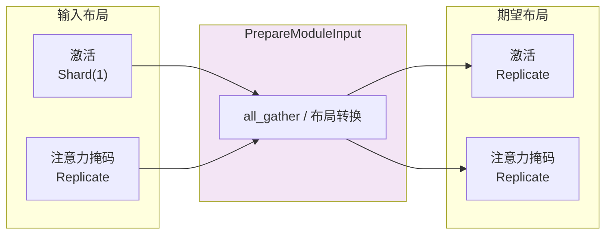

**图 16.** `PrepareModuleInput` 将 `SequenceParallel` 后的 `Shard(1)` 激活转换为 `Replicate`，以匹配 Attention/FeedForward 的输入要求。

- **含义**：Attention 模块的输入原本是 `(序列维度分片, 复制)` 的元组布局（来自 `SequenceParallel` 后的残差连接），需要转换为 `(复制, 复制)`，才能进入 `ColwiseParallel` 的 Attention 子层。
- **自动通信**：`DTensor` 会自动插入 `all_gather` 等通信操作完成布局转换。

### TransformerBlock 的核心结构

Transformer 模型通过堆叠相同的 `TransformerBlock` 来扩展模型规模。核心 `TransformerBlock` 由一个注意力层和一个前馈层组成。我们先来看结构更简单的前馈层。

#### 前馈层（FeedForward）

前馈层包含三个线性层，执行 SwiGLU 风格的 MLP。其前向函数如下：

```python
def forward(self, x):
    # 前馈层中的前向传播
    return self.w2(F.silu(self.w1(x)) * self.w3(x))
```

上述前向函数首先并行计算 `w1(x)` 和 `w3(x)`，然后将 `w2` 的矩阵乘法应用于 SwiGLU 组合结果。借鉴 Megatron-LM 张量并行的思想，可将 `w1`/`w3` 按列方式分片、`w2` 按行方式分片，从而在整个前馈层结束时只需要一次 `all_reduce` 通信。

使用 PyTorch 原生张量并行，我们可以为前馈层创建如下 `parallelize_plan`：

```python
from torch.distributed.tensor.parallel import ColwiseParallel, RowwiseParallel, parallelize_module

layer_tp_plan = {
    # 默认 ColwiseParallel 输入布局为 Replicate
    # 默认 RowwiseParallel 输出布局为 Replicate
    "feed_forward.w1": ColwiseParallel(),
    "feed_forward.w2": RowwiseParallel(),
    "feed_forward.w3": ColwiseParallel(),
}
```

这就是使用 PyTorch 张量并行 API 配置前馈层分片的方式。注意，用户只需要指定如何分片各个层，通信（例如 `all_reduce`）将在后台自动发生。

#### 注意力层（Attention）

注意力层包含 `wq`、`wk`、`wv` 线性层，将输入投影到 q/k/v，然后执行注意力计算，并通过 `wo` 线性层进行输出投影。这里的张量并行方案是：对 q/k/v 投影执行列方向分片，对 `wo` 线性投影执行行方向分片。因此我们可以将注意力层的分片计划添加到刚刚起草的 `layer_tp_plan` 中：

```python
layer_tp_plan = {
    # 默认 ColwiseParallel 输入布局为 Replicate
    # 默认 RowwiseParallel 输出布局为 Replicate
    "attention.wq": ColwiseParallel(use_local_output=False),
    "attention.wk": ColwiseParallel(use_local_output=False),
    "attention.wv": ColwiseParallel(use_local_output=False),
    "attention.wo": RowwiseParallel(),
    "feed_forward.w1": ColwiseParallel(),
    "feed_forward.w2": RowwiseParallel(),
    "feed_forward.w3": ColwiseParallel(),
}
```

这几乎就是应用张量并行到 `TransformerBlock` 所需的 `layer_tp_plan`。然而，我们需要注意的一点是，当按列方向分片线性层时，线性层的输出将在最后一个张量维度上分片，而行方向分片的线性层直接接受在最后一个维度上分片的输入。

如果在列方向线性和行方向线性之间有任何额外的张量操作（如 `view` 操作），我们需要调整相关的形状操作以适应分片形状。

对于 Llama 模型，在注意力层中有几个与形状相关的 `view` 操作。具体来说，对于 `wq`/`wk`/`wv` 线性层的列方向并行，激活张量在 `num_heads` 维度上分片。为了管理全局和局部 `num_heads` 之间的差异，我们应该设置 `use_local_output=False` 以确保输出是 `DTensor`。与普通张量不同，`DTensor` 了解并行计划，并将自动处理 `num_heads` 维度的变化。

最后，我们需要调用 `parallelize_module` API 使每个 `TransformerBlock` 的计划生效。在底层，它将注意力层和前馈层内的模型参数分发到 `DTensor`，并在必要时为模块输入和输出注册通信钩子（在每个模块前后分别注册）：

```python
for layer_id, transformer_block in enumerate(model.layers):
    layer_tp_plan = {...} # 即我们刚刚生成的计划

    parallelize_module(
        module=transformer_block,
        device_mesh=tp_mesh,
        parallelize_plan=layer_tp_plan,
    )
```

#### 词嵌入和输出层

既然我们已经详细阐述了每个 `TransformerBlock` 的分片计划，通常第一层有 `nn.Embedding`，最后一层有 `nn.Linear` 投影层。用户可以选择对第一层 `nn.Embedding` 进行行方向或列方向分片，对最后一层 `nn.Linear` 投影层进行列方向分片，并指定适当的输入和输出布局。

以下是一个示例：

```python
model = parallelize_module(
    model,
    tp_mesh,
    {
        "tok_embeddings": RowwiseParallel(
            input_layouts=Replicate(),
        ),
        "output": ColwiseParallel(
            output_layouts=Replicate(),
        ),
    }
)
```

> **注意**：如果要分片的模型太大而无法放入 CPU 内存，可以使用 meta device 初始化（例如，首先在 meta device 上初始化模型，分片各层，然后实例化模型），或者在 Transformer 模型初始化期间逐层并行化 `TransformerBlock`。

---

## 对 LayerNorm/RMSNorm 层应用序列并行

序列并行在上述张量并行的基础上工作。与基本张量并行相比，基本张量并行仅在注意力模块和前馈模块内分片张量，并保持其模块输入和输出（即前向传播中的激活和反向传播中的梯度）为复制状态；序列并行则将它们保持在序列维度上的分片状态。

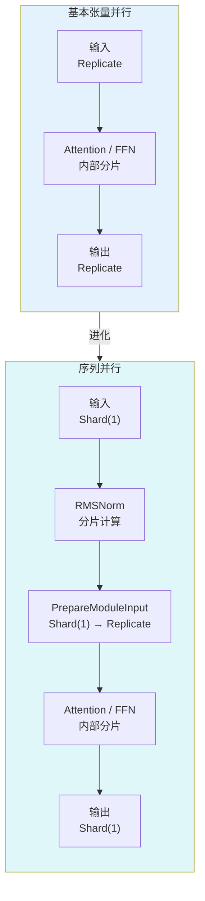

**图 17.** 基本张量并行与序列并行的对比：前者在模块输入/输出保持 `Replicate`，后者在序列维度保持 `Shard(1)` 以节省激活内存。

在典型的 `TransformerBlock` 中，前向函数结合归一化层（LayerNorm 或 RMSNorm）、注意力层、前馈层和残差连接。例如：

```python
def forward(self, x):
    # TransformerBlock 中的前向传播
    h = x + self.attention(self.attention_norm(x))
    out = h + self.feed_forward(self.ffn_norm(h))
    return out
```

在大多数用例中，激活（和梯度）在注意力和前馈模块外部的形状为 `[batch_size, sequence_length, hidden_dimension]`。用 `DTensor` 的语言来说，序列并行对模块的前向/反向传播使用 `Shard(1)` 布局执行激活计算，即在 `sequence_length` 维度上分片。

按照前面的代码示例，下面的代码演示如何对 `TransformerBlock` 内的 RMSNorm 层应用序列并行。

首先导入序列并行所需的依赖：

```python
from torch.distributed.tensor.parallel import (
    PrepareModuleInput,
    SequenceParallel,
)
```

接下来调整 `layer_tp_plan` 以在 RMSNorm 层上启用序列并行：

```python
layer_tp_plan = {
    # 现在 SequenceParallel 的输入和输出具有 Shard(1) 布局，
    # 表示输入/输出张量在序列维度上分片
    "attention_norm": SequenceParallel(),
    "attention": PrepareModuleInput(
        input_layouts=(Shard(1), Replicate()),
        desired_input_layouts=(Replicate(), Replicate()),
    ),
    "attention.wq": ColwiseParallel(use_local_output=False),
    "attention.wk": ColwiseParallel(use_local_output=False),
    "attention.wv": ColwiseParallel(use_local_output=False),
    "attention.wo": RowwiseParallel(output_layouts=Shard(1)),
    "ffn_norm": SequenceParallel(),
    "feed_forward": PrepareModuleInput(
        input_layouts=(Shard(1),),
        desired_input_layouts=(Replicate(),),
    ),
    "feed_forward.w1": ColwiseParallel(),
    "feed_forward.w2": RowwiseParallel(output_layouts=Shard(1)),
    "feed_forward.w3": ColwiseParallel(),
}
```

通过上述配置，我们使用 `PrepareModuleInput` 将注意力层和前馈层的模块输入布局从 `Shard(1)` 转换为 `Replicate()`，并将其输出布局标记为 `Shard(1)`。

与张量并行一样，用户只需要指定输入和输出的张量分片布局，层之间的通信将自动发生。

注意，使用序列并行时，我们假设 `TransformerBlock` 的输入和输出始终在序列维度上分片，以便多个 `TransformerBlock` 可以无缝连接。

这可以通过显式指定开头 `nn.Embedding` 层的输出和最终 `nn.Linear` 投影层的输入为 `Shard(1)` 来实现：

```python
model = parallelize_module(
    model,
    tp_mesh,
    {
        "tok_embeddings": RowwiseParallel(
            input_layouts=Replicate(),
            output_layouts=Shard(1),
        ),
        "norm": SequenceParallel(),
        "output": ColwiseParallel(
            input_layouts=Shard(1),
            output_layouts=Replicate()
        ),
    }
)
```

---

## 应用 Loss Parallel

Loss Parallel 是一种相关技术，用于在计算损失函数时节省内存和通信，因为模型输出通常非常大。在 Loss Parallel 中，当模型输出在（通常巨大的）词汇维度上分片时，可以高效地计算交叉熵损失，而无需将所有模型输出收集到每个 GPU 上。这不仅显著降低了内存消耗，还通过减少通信开销和并行执行分片计算来提高训练速度。

下图简要说明了 Loss Parallel 如何通过分片计算避免将所有模型输出收集到每个 GPU 上。


**图 18.** 在一个 GPU 上使用 Loss Parallel 进行交叉熵损失前向计算。蓝色表示分片张量；绿色表示复制张量；黄色表示具有部分值的张量（待 `all_reduce`）。黑色箭头是本地计算；红色箭头是 GPU 间的函数式集合通信。

在 PyTorch 张量并行 API 中，Loss Parallel 可以通过上下文管理器 `loss_parallel` 启用。使用该上下文管理器可以直接调用 `torch.nn.functional.cross_entropy` 或 `torch.nn.CrossEntropyLoss`，无需修改其他代码。

要应用 Loss Parallel，模型预测（通常形状为 `[batch_size, sequence_length, vocabulary_size]`）应该在词汇维度上分片。这可以通过标记最后一层线性投影层输出的输出布局来轻松实现：

```python
model = parallelize_module(
    model,
    tp_mesh,
    {
        "tok_embeddings": RowwiseParallel(
            input_layouts=Replicate(),
            output_layouts=Shard(1),
        ),
        "norm": SequenceParallel(),
        "output": ColwiseParallel(
            input_layouts=Shard(1),
            # 使用 DTensor 作为输出
            use_local_output=False,
        ),
    },
)
```

在上面的代码中，我们还将序列并行应用于输出之前的归一化层。我们应用 `use_local_output=False` 让输出保持为 `DTensor`，以与 `loss_parallel` 上下文管理器配合工作。之后，可以简单地按如下方式调用 `cross_entropy` 损失函数。注意反向计算也需要在上下文内发生。

```python
import torch.nn.functional as F
from torch.distributed.tensor.parallel import loss_parallel

pred = model(input_ids)
with loss_parallel():
    # 假设 pred 和 labels 的形状为 [batch, seq, vocab]
    loss = F.cross_entropy(pred.flatten(0, 1), labels.flatten(0, 1))
    loss.backward()
```

---

## 将张量并行与完全分片数据并行结合

既然我们已经展示了如何对模型应用张量/序列并行，接下来介绍张量并行和 FSDP2 如何协同工作。

由于张量并行会产生阻塞计算的通信，我们希望确保它在快速通信通道内运行，例如 NVLink。

在实践中，我们通常**在每台主机内应用张量并行，跨主机应用完全分片数据并行**。

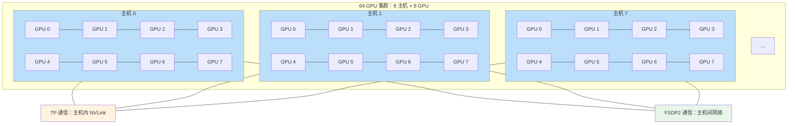

**图 19.** 2-D 并行拓扑：每台主机内部 8 个 GPU 之间运行 TP（蓝色），主机之间运行 FSDP2（跨主机网络）。


**图 20.** FSDP2 和 TP 在不同的设备维度上工作，FSDP2 通信发生在主机间，TP 通信发生在主机内。

这种 2-D 并行模式可以通过 2-D `DeviceMesh` 轻松表达，我们只需要将每个“子”`DeviceMesh` 传递给各个并行 API：

```python
from torch.distributed.device_mesh import init_device_mesh
from torch.distributed.tensor.parallel import ColwiseParallel, RowwiseParallel, parallelize_module
from torch.distributed.fsdp import fully_shard

mesh_2d = init_device_mesh("cuda", (8, 8))  # 2-D mesh 为 [dp, tp]，在 64 个 GPU 上训练，执行 8 路 DP 和 8 路 TP
tp_mesh = mesh_2d["tp"]  # 连接主机内设备的子 mesh
dp_mesh = mesh_2d["dp"]  # 连接跨主机设备的子 mesh

model = Model(...)
tp_plan = {...}

model_tp = parallelize_module(model, tp_mesh, tp_plan)  # 主机内张量并行
model_2d = fully_shard(model_tp, mesh=dp_mesh)          # 跨主机 FSDP2
```

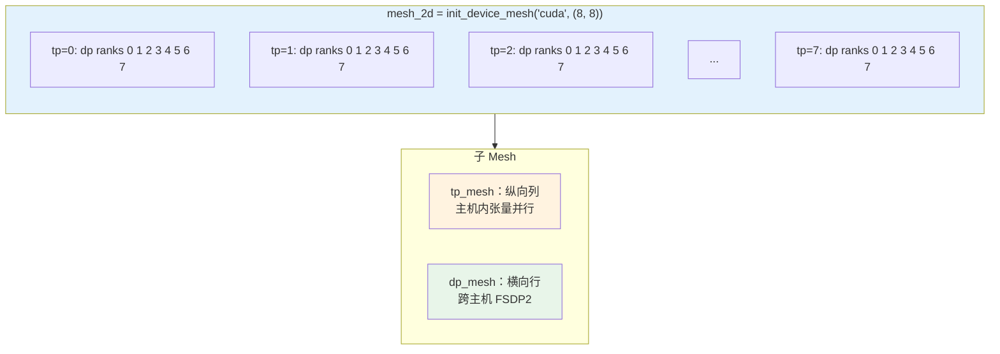

**图 21.** 形状为 `[8, 8]` 的 2-D `DeviceMesh`。横向切片为 `dp_mesh`，纵向切片为 `tp_mesh`。

`init_device_mesh("cuda", (8, 8))` 创建一个形状为 `[dp_size=8, tp_size=8]` 的二维设备网格。`mesh_2d["tp"]` 取出张量并行维度对应的子网格，`mesh_2d["dp"]` 取出数据并行维度对应的子网格。

这使我们能够轻松地在每台主机内应用张量并行，跨主机应用 FSDP2，**对 Llama 模型代码零修改**。

张量（模型）并行和数据并行技术结合在一起，提供了继续使用大量 GPU 增加模型大小并高效训练的能力。

---

## 结论

本教程演示了如何使用张量并行结合 FSDP2，在数百到数千张 GPU 上训练大规模 Transformer 模型。它解释了如何对模型的不同部分应用张量并行，而无需对模型本身进行任何代码修改。张量并行是一种高效的大规模训练模型并行技术。

要查看本教程中解释的完整端到端代码示例，请参阅 PyTorch/examples 仓库中的 [张量并行示例](https://github.com/pytorch/examples/blob/main/distributed/tensor_parallelism/tensor_parallel_example.py)。
